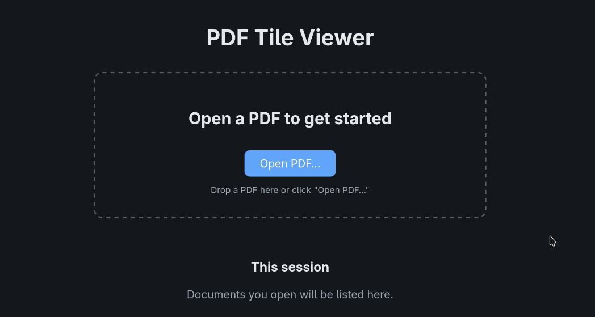
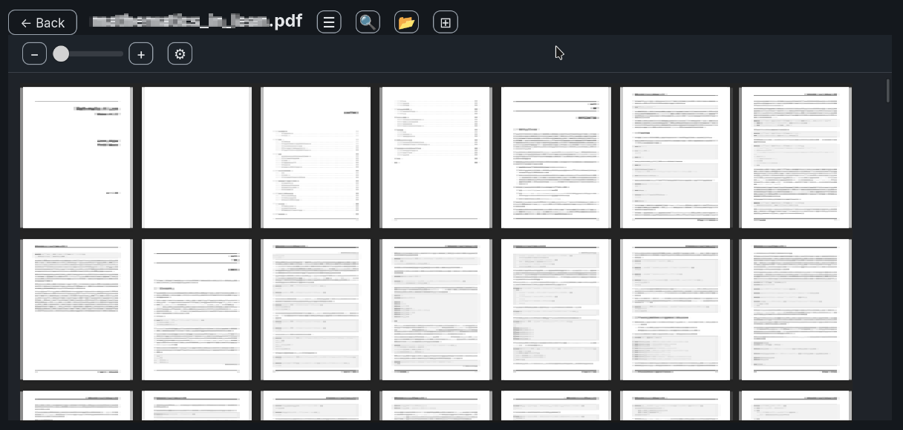
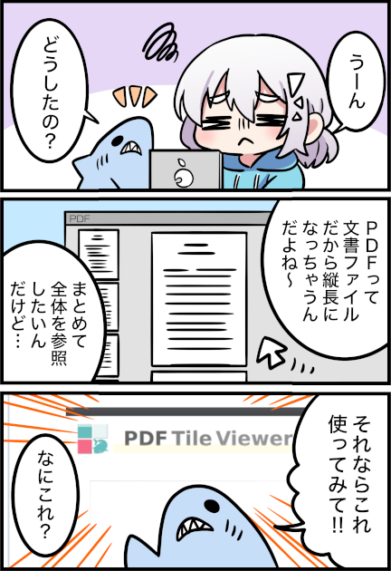

# PDF Tile Viewer

[English](README.md)

ローカルファーストのデスクトップ用 PDF ビューアーです。すべてのページをスクロール可能なタイル状のグリッドに配置して表示します。ページを 1 枚ずつめくるのではなく、一目でドキュメントの構成を把握できます。

  
  

## 用途

次のような場合に使えます。

- 文書を最初から順に読むことなく、**全体の構成を把握したい**。
- 複数のページを並べて表示し、**一目で比較したい**。
- 長いレポート、マニュアル、スライド資料の中から、**特定のページを視覚的に見つけたい**。
- 文書を**ローカル環境に保持したい**（クラウドへのアップロード、アカウント登録、テレメトリ送信は一切ありません）。

## 使用法

[Releases](https://github.com/nabbisen/pdf-tile-viewer/releases) ページ内に最新の実行ファイルがあります。インストールは不要です。実行ファイルを起動するだけで使えます。

### 注意: アプリにはコード署名がありません。

お使いの OS (Windows / macOS) によっては、セキュリティ警告が表示される場合があります。
このアプリを信頼できる場合は、OS 固有の手順に従って許可してください。    
不便であり恐縮ですが、私たちはボランティアであり、証明書は高額なのです。

## 特徴

_(manga by m. thanks)_

- 🟨 PDF ページのタイルレイアウト表示
- ✊ Ctrl キーを押しながらマウスドラッグして移動
- 🔧 倍率 / 行あたりページ が変更可能
- 🔍 ページのズーム表示
- 🗺 テキスト検索
- 🍵 禅モード
- 🗄 一部設定の保存 (アプリ再起動後も有効)
- 🚪 再表示用リンク付きファイル履歴 (アプリ実行中のみ有効)

## さらに詳しく知りたい時

詳細なドキュメントは `docs/` にあります（mdbook形式、英語）：

- **[新規ユーザー向け](docs/src/new-users/):** features, tutorials, FAQ
- **[中級ユーザー向け](docs/src/intermediate/):** settings reference, keyboard shortcuts
- **[コントリビューター向け](docs/src/contributors/):** architecture overview, RFC index, local dev guide
