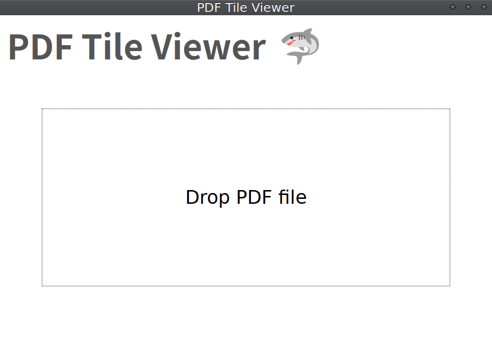
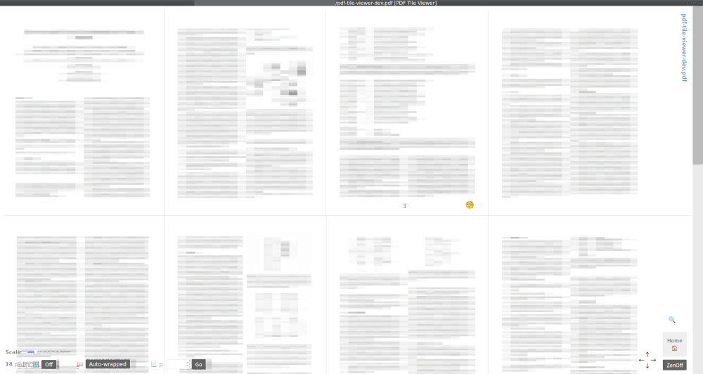

# PDF Tile Viewer

PDF viewer/reader displayed in tile layout. Number of pages in a row is dynamically calculated with app window size and zoom scale modified with Ctrl key + mouse wheel. Customization is also available.

タイル形式の PDF ビュアー / リーダー です。行あたりページ数を、アプリ Window サイズと、Ctrl + マウスホイールで変更可能なズーム倍率から、動的計算します。手動設定も可能です。

  
  

## Usage

The Latest executables on multiple platforms are in [Releases](https://github.com/nabbisen/pdf-tile-viewer/releases). No Installation is required. Just launch the executable to start.

[Releases](https://github.com/nabbisen/pdf-tile-viewer/releases) ページ内に最新の実行ファイルがあります。インストールは不要です。実行ファイルを起動するだけで使えます。

## Features

- 🟨 Tile layout view on PDF pages | PDF ページのタイルレイアウト表示
- 🔧 Scale / pages-per-row changers | 倍率 / 行あたりページ が変更可能
- 🔍 Page zoom view | ページのズーム表示
- 🗺 Text search | テキスト検索
- 🍵 Zen mode | 禅モード
- 🗄 Preserve some settings (even when app's quitted) | 一部設定の保存 (アプリ再起動後も有効)
- 🚪 Files history with links to open again (Kept only while app's running) | 再表示用リンク付きファイル履歴 (アプリ実行中のみ有効)
