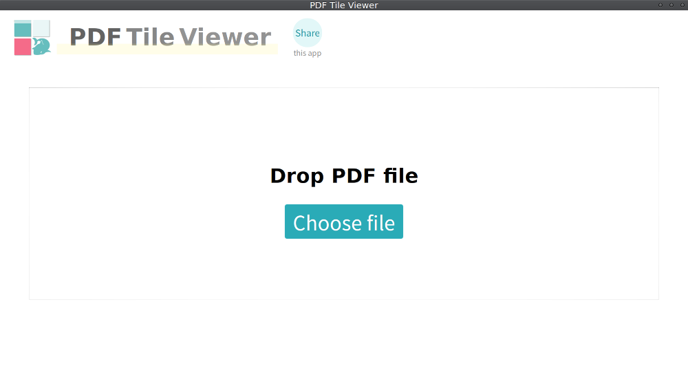

# PDF Tile Viewer

PDF viewer/reader displayed in tile layout. Number of pages in a row is dynamically calculated with app window size and zoom scale modified with Ctrl key + mouse wheel.

タイル形式の PDF ビュアー / リーダー です。行あたりページ数を、アプリ Window サイズと、Ctrl + マウスホイールで変更可能なズーム倍率から、動的計算します。

  
  

The Latest executables on multiple platforms are in [Releases](https://github.com/nabbisen/pdf-tile-viewer/releases). No Installation is required. Just launch the executable to start.

[Releases](https://github.com/nabbisen/pdf-tile-viewer/releases) ページ内に最新の実行ファイルがあります。インストールは不要です。実行ファイルを起動するだけで使えます。
