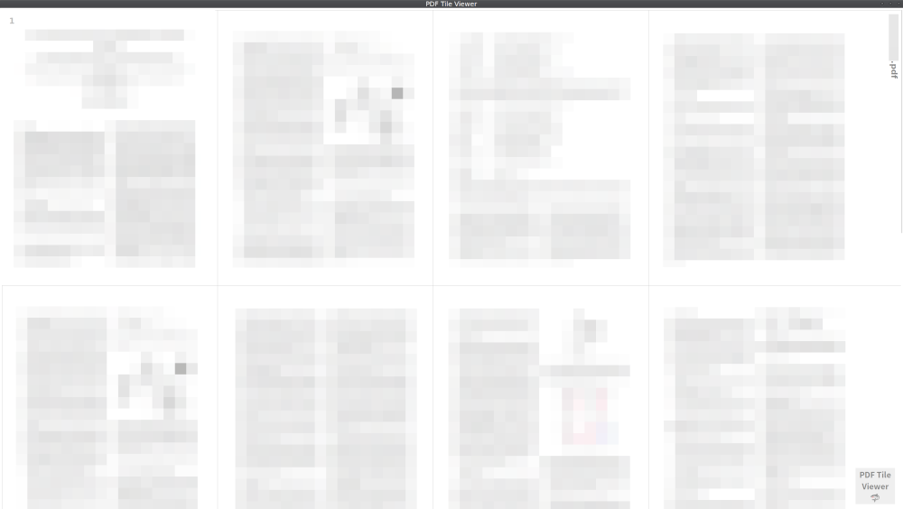

# PDF Tile Viewer

PDF viewer/reader displayed in tile layout.

タイル形式の PDF ビュアー / リーダー です。

<p style="display: flex; gap: 0.8rem;">
  
  
</p>

## Development

### Command-lines

To develop:

```sh
bun run tauri dev
```

To build:

```sh
env NO_STRIP=1 bun run tauri build
```

### Powered-by

- [Tauri (v2)](https://v2.tauri.app/) (using [WRY](https://github.com/tauri-apps/wry), cross-platform WebView rendering library), [Rust](https://www.rust-lang.org/)
- [SvelteKit](https://kit.svelte.dev/), [PDF.js](https://mozilla.github.io/pdf.js/), [Vite](https://vitejs.dev/), [TypeScript](https://www.typescriptlang.org/), [Bun](https://bun.sh/)

### IDE Setup (Optional)

- [VS Codium](https://vscodium.com/) | [VS Code](https://code.visualstudio.com/)
  - [rust-analyzer](https://marketplace.visualstudio.com/items?itemName=rust-lang.rust-analyzer), [Svelte](https://marketplace.visualstudio.com/items?itemName=svelte.svelte-vscode), [Tauri](https://marketplace.visualstudio.com/items?itemName=tauri-apps.tauri-vscode)
