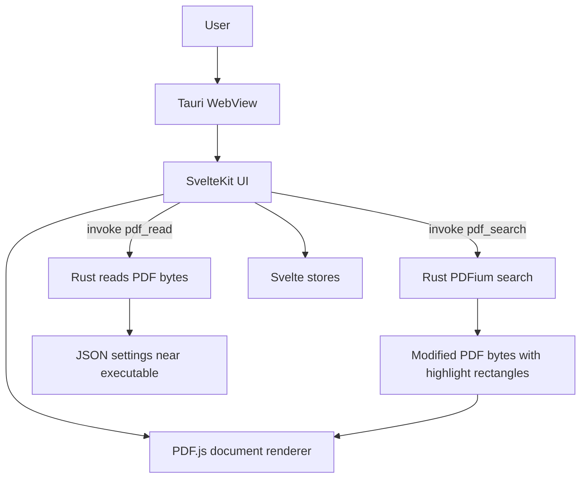
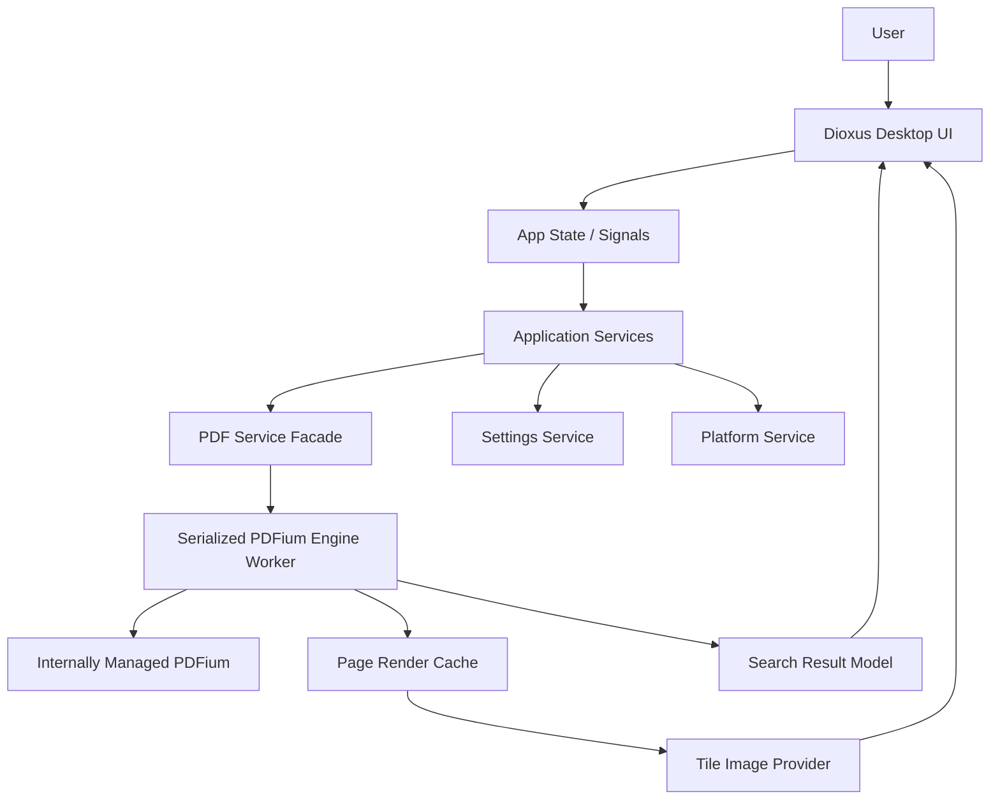
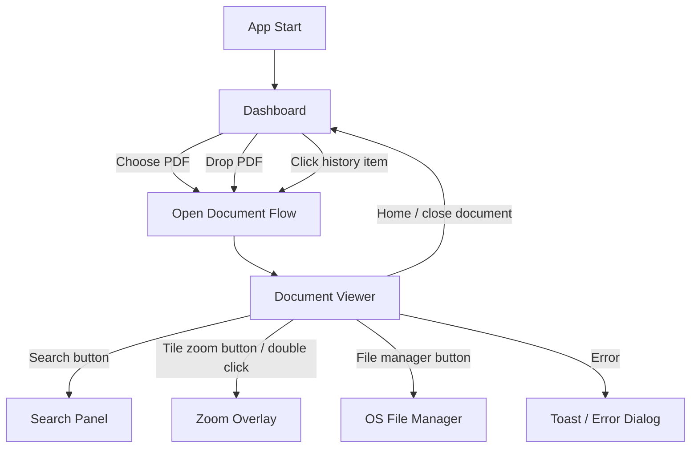
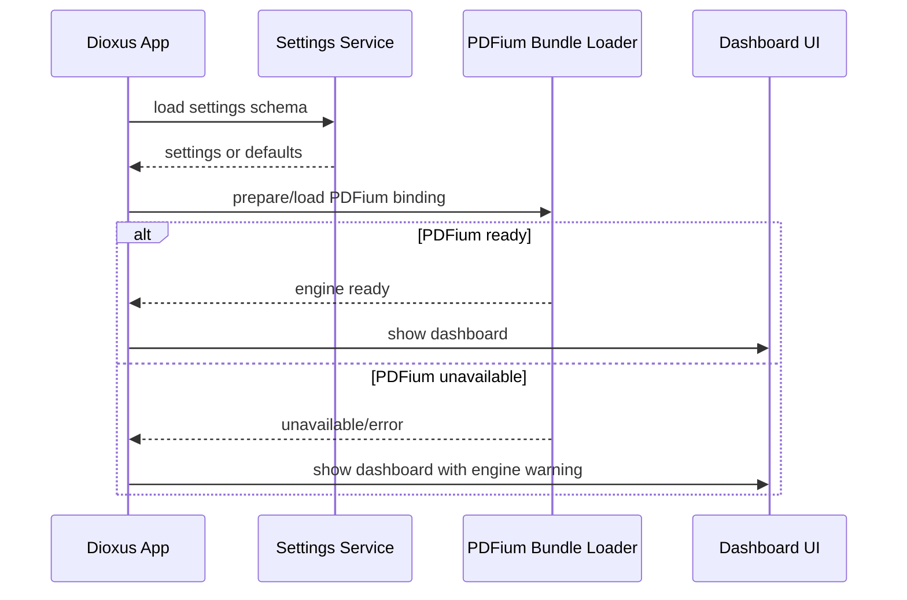
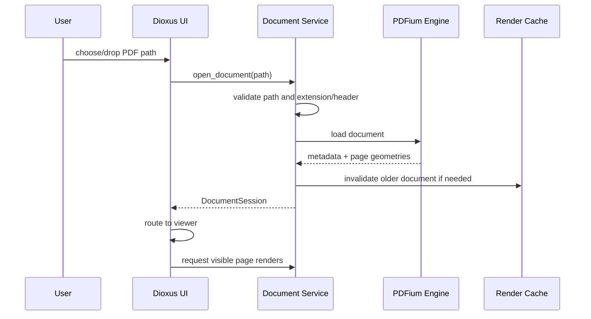
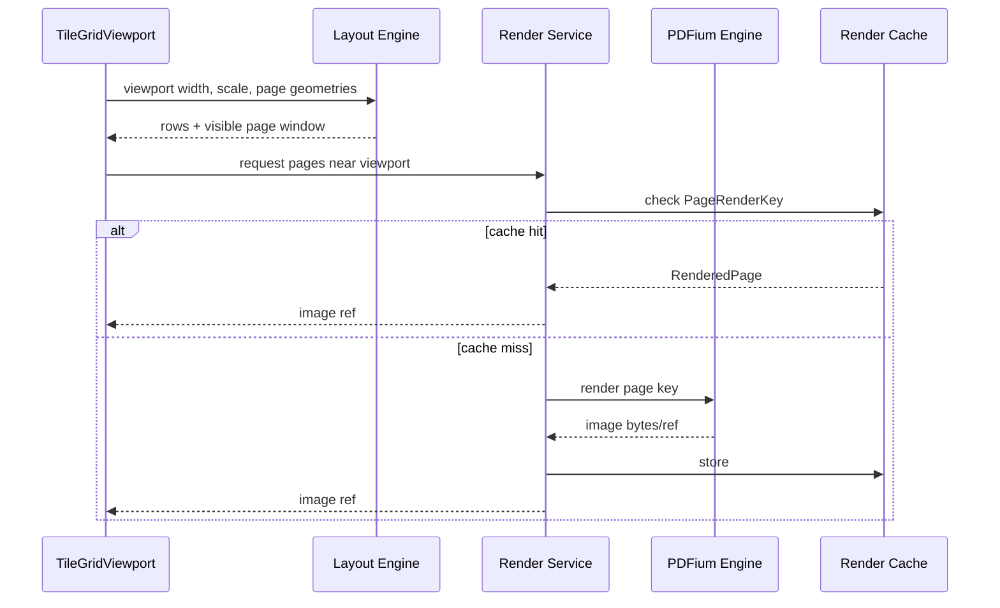
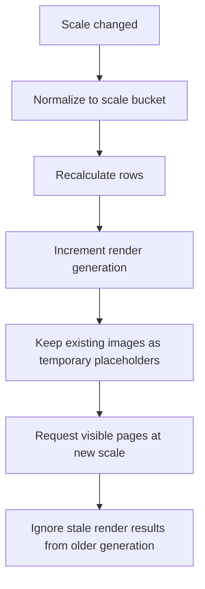
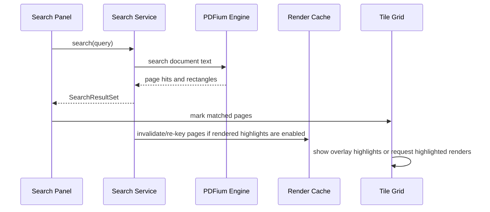
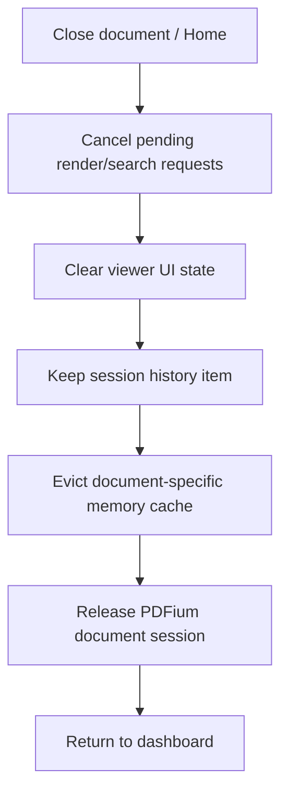

# PDF Tile Viewer Goal-State External Design

**Target:** Dioxus Desktop + Rust-first PDFium rendering + internally managed PDFium distribution  
**Baseline analyzed:** PDF Tile Viewer v1.1.2 source archive  
**Document type:** External design / reverse-forward target design  
**Language:** English  
**Date:** 2026-06-07

---

## 1. Executive Summary

PDF Tile Viewer should migrate from the current **Tauri + Svelte + PDF.js + external PDFium dynamic library** architecture to a **Dioxus Desktop + Rust/PDFium image-tile rendering architecture**.

The migration is feasible, but the target should be designed as a renderer and lifecycle redesign, not as a simple UI port. The current frontend relies on PDF.js to load and draw pages inside the WebView. In the target design, PDFium becomes the authority for document opening, page geometry, page rendering, text search, and search-result coordinates. Dioxus renders the application UI and displays page images produced by the Rust PDF service.

The product should preserve the existing core user value:

> Open a PDF quickly, view many pages at once in an adaptive tile layout, zoom or change pages-per-row, search text, identify matched pages, and inspect one page in a zoom overlay.

The target design intentionally avoids trying to reproduce every PDF.js viewer feature. The first Dioxus version should focus on the unique tile-viewing workflow and should not introduce text selection, full annotation editing, advanced form support, or complex PDF editing.

---

## 2. Design Goals

### 2.1 Primary Goals

1. **Preserve the tile-viewer product identity**
   - Multi-page PDF overview is the central value.
   - Page layout must adapt to window width and zoom scale.
   - Manual fixed pages-per-row must remain available.

2. **Move product code to Rust-first architecture**
   - Replace Svelte stores with Rust state/signals.
   - Replace Tauri command IPC with direct Rust module calls or internal async services.
   - Reduce JavaScript/TypeScript surface area to zero in core product logic.

3. **Remove PDF.js from the final rendering path**
   - PDFium renders page images.
   - Search and rendering use the same PDF engine.
   - Highlight coordinates come from PDFium and are transformed consistently into tile coordinates.

4. **Internally manage PDFium distribution**
   - Users should not manually place `libpdfium` in an external directory.
   - First target: bundled dynamic PDFium loaded from app-controlled resource/cache path.
   - Later optional target: statically linked PDFium.

5. **Handle large documents responsibly**
   - Lazy rendering.
   - Prefetch only near visible rows.
   - Bounded memory cache.
   - Cancellation or generation-based stale-result suppression.

6. **Keep the app lightweight and understandable**
   - Avoid a large framework stack.
   - Keep domain services independent from Dioxus components.
   - Preserve simple local desktop behavior.

### 2.2 Secondary Goals

1. Improve error messages for unsupported, encrypted, corrupted, or too-large PDFs.
2. Make settings naming and persistence more explicit.
3. Prepare the codebase for future backends or GUI toolkits by separating domain logic.
4. Improve accessibility around keyboard navigation and controls.
5. Make release artifacts clearer for Windows, macOS, and Linux users.

---

## 3. Non-Goals

The first Dioxus + PDFium target should **not** attempt the following:

1. Removing WebView completely.
2. Implementing a full native GPU PDF viewer.
3. Supporting mobile platforms.
4. Editing PDF content.
5. Persisting search highlights into the PDF file.
6. Advanced annotation workflows.
7. Full text selection layer.
8. Full PDF forms support.
9. Multi-document tabbed workspace.
10. Cloud sync, account, or network features.

These may become future roadmap items, but they must not block the first stable migration.

---

## 4. Baseline Behavior to Preserve

The v1.1.2 app provides the following visible user functions. The target design should preserve them unless explicitly deferred.

| Current behavior | Target policy |
|---|---|
| Open PDF through file picker | Preserve |
| Open PDF through drag and drop | Preserve |
| Runtime history of opened files | Preserve, improve later with optional persisted recent files |
| Tile layout of all pages | Preserve as core behavior |
| Auto pages-per-row based on window width and page width | Preserve |
| Fixed pages-per-row mode | Preserve |
| Ctrl + mouse wheel scale control | Preserve where platform event behavior allows |
| Scale slider | Preserve |
| Page number visibility toggle | Preserve |
| Jump to page | Preserve |
| Search text | Preserve |
| Display matched page list | Preserve |
| Mark matched pages visually | Preserve using overlay/highlight model |
| Zoomed page overlay | Preserve |
| Zoom overlay background lock | Preserve |
| Zoom overlay transparency | Preserve if still useful; otherwise move to advanced setting |
| Zen mode | Preserve as distraction-free tile view |
| File-manager open | Preserve |
| Window title includes opened path | Preserve, but consider privacy setting |
| Persistent settings | Preserve with schema version |

---

## 5. Architectural Summary

### 5.1 Baseline Architecture



### 5.2 Target Architecture



### 5.3 Architectural Rule

Dioxus components must not directly own PDFium objects. Dioxus components may own view state and request rendering/search operations through services. PDFium document handles, page handles, and native resources live inside the PDF service boundary.

---

## 6. Recommended Workspace Structure

```text
pdf-tile-viewer/
├── Cargo.toml
├── Dioxus.toml
├── README.md
├── LICENSE
├── crates/
│   ├── app/
│   │   ├── src/main.rs
│   │   ├── src/app.rs
│   │   ├── src/routes.rs
│   │   ├── src/components/
│   │   ├── src/screens/
│   │   └── assets/
│   ├── domain/
│   │   ├── src/document.rs
│   │   ├── src/viewer.rs
│   │   ├── src/search.rs
│   │   ├── src/settings.rs
│   │   └── src/errors.rs
│   ├── pdf_engine/
│   │   ├── src/lib.rs
│   │   ├── src/pdfium_loader.rs
│   │   ├── src/session.rs
│   │   ├── src/render.rs
│   │   ├── src/search.rs
│   │   └── src/geometry.rs
│   ├── app_services/
│   │   ├── src/document_service.rs
│   │   ├── src/render_service.rs
│   │   ├── src/settings_service.rs
│   │   ├── src/history_service.rs
│   │   └── src/platform_service.rs
│   └── packaging/
│       ├── src/pdfium_bundle.rs
│       └── src/app_dirs.rs
├── ci/
│   ├── fetch-pdfium.sh
│   ├── fetch-pdfium.ps1
│   ├── package-linux.sh
│   ├── package-windows.ps1
│   └── package-macos.sh
└── docs/
    ├── architecture.md
    ├── rendering-pipeline.md
    └── release-packaging.md
```

### 6.1 Module Responsibilities

| Module | Responsibility | Must not do |
|---|---|---|
| `app` | Dioxus UI, routing, event handlers, UI composition | Direct PDFium calls |
| `domain` | Pure data types and product rules | Platform I/O, PDFium FFI |
| `pdf_engine` | PDFium binding, document sessions, rendering, search | UI layout decisions |
| `app_services` | App-level orchestration, async tasks, cache coordination | Widget rendering details |
| `packaging` | Locate, extract, verify, and bind bundled PDFium | PDF document behavior |

---

## 7. UI / UX External Design

### 7.1 Screen Map



### 7.2 Dashboard Screen

The dashboard is the entry point when no document is open.

```text
+--------------------------------------------------------------------------------+
| PDF Tile Viewer                                                                 |
+--------------------------------------------------------------------------------+
|                                                                                |
|  +--------------------------------------------------------------------------+  |
|  |                                                                          |  |
|  |                         Drop PDF file here                               |  |
|  |                                                                          |  |
|  |                         [ Choose file ]                                  |  |
|  |                                                                          |  |
|  |       Tip: Ctrl + mouse wheel changes tile scale after opening.           |  |
|  |                                                                          |  |
|  +--------------------------------------------------------------------------+  |
|                                                                                |
|  Recent this session                                                           |
|  --------------------------------------------------------------------------    |
|  14:22:13  sample.pdf                /home/user/docs/sample.pdf                |
|  14:09:44  report.pdf                /home/user/work/report.pdf                |
|                                                                                |
+--------------------------------------------------------------------------------+
```

#### Dashboard Requirements

| Element | Behavior |
|---|---|
| App title | Shows product name and version in accessible text. |
| Drop zone | Accepts one PDF path. If multiple files are dropped, open the first PDF and show a warning, or reject with clear message. |
| Choose file button | Opens platform file picker filtered to PDF by default. |
| Recent this session | Shows in-memory history sorted newest first. |
| Recent item | Opens the selected file if still available. |
| Error feedback | Invalid or missing files produce a visible error. |

### 7.3 Document Viewer Screen

The document viewer is the primary product screen.

```text
+--------------------------------------------------------------------------------+
| sample.pdf                                           [Zen] [Search] [Home] [⋯] |
+--------------------------------------------------------------------------------+
|                                                                                |
|   +-------------+ +-------------+ +-------------+ +-------------+              |
|   |             | |             | |             | |             |              |
|   |   Page 1    | |   Page 2    | |   Page 3    | |   Page 4    |              |
|   |             | |             | |             | |             |              |
|   |          🔍 | |          🔍 | |          🔍 | |          🔍 |              |
|   +-------------+ +-------------+ +-------------+ +-------------+              |
|                                                                                |
|   +-------------+ +-------------+ +-------------+ +-------------+              |
|   |             | |             | |             | |             |              |
|   |   Page 5    | |   Page 6    | |   Page 7    | |   Page 8    |              |
|   |             | |             | |             | |             |              |
|   +-------------+ +-------------+ +-------------+ +-------------+              |
|                                                                                |
| [Scale ───────●────]  Pages: 120  [🔢 On]  [📖 Auto-wrapped]  Go p.[  42 ] [Go]|
+--------------------------------------------------------------------------------+
```

#### Viewer Requirements

| Element | Behavior |
|---|---|
| Header title | Shows file name by default. Full path may be shown in tooltip or title if privacy setting permits. |
| Tile grid | Displays rendered page images in rows. |
| Tile border | Separates pages visually without overpowering the PDF content. |
| Page number | Optional. Visible when setting is on and Zen mode is off. |
| Zoom icon | Opens zoom overlay for page. Keyboard equivalent required. |
| Scale control | Changes tile image scale. Must trigger re-layout and re-render as needed. |
| Pages-per-row mode | Auto or fixed. Auto computes from viewport width and scaled page width. |
| Jump-to-page | Scrolls target tile into view and briefly marks it. |
| Matched-page marker | Search hits mark page tile; exact text highlights are overlaid or rendered depending on implementation phase. |
| Zen mode | Hides header, aside controls, page numbers, search markers, and non-essential chrome. |

### 7.4 Search Panel

```text
                     +------------------------------------+
                     | Search PDF                         |
                     | [ keyword....................... ] |
                     | [ Search ]                         |
                     |                                    |
                     | Last keyword: architecture         |
                     | Matched: p.2, 8~10, 24             |
                     |                                    |
                     | [Clear]                  [Close]   |
                     +------------------------------------+
```

#### Search Requirements

| Element | Behavior |
|---|---|
| Search input | Minimum length defaults to 3 characters. |
| Search action | Sends request to PDF service. |
| Clear action | Clears search results and highlight overlays without reloading the full document. |
| Matched pages | Displays compact page ranges, for example `p.1, 3~5, 9`. |
| Tile marker | All pages with matches receive a visible marker. |
| Exact text highlight | Target behavior: render or overlay rectangles at match bounds. |
| Error handling | Encrypted, non-extractable, or engine errors are shown clearly. |

### 7.5 Zoom Overlay

```text
+--------------------------------------------------------------------------------+
|                                                                                |
|          +------------------------------------------------------------+        |
|          |                                                            |        |
|          |                   Zoomed Page Image                         |        |
|          |                                                            |        |
|          +------------------------------------------------------------+        |
|          | [←] p.42 [→]  Background: [Locked]  Scale [────●] [Close]   |        |
|          +------------------------------------------------------------+        |
|                                                                                |
+--------------------------------------------------------------------------------+
```

#### Zoom Overlay Requirements

| Element | Behavior |
|---|---|
| Open | Click/tap zoom icon, double-click page tile, or keyboard command while tile focused. |
| Close | Escape key, Close button, or click outside if configured. |
| Previous/next | Navigates pages without closing overlay. |
| Zoom scale | Independent from tile-grid scale. |
| Background lock | Prevents background scrolling while overlay is open if enabled. |
| Transparency | Optional advanced control; may be hidden by default if it creates visual complexity. |

### 7.6 Zen Mode

Zen mode is a low-distraction reading/overview mode.

```text
+--------------------------------------------------------------------------------+
|                                                                                |
|   +-------------+ +-------------+ +-------------+ +-------------+              |
|   |             | |             | |             | |             |              |
|   |             | |             | |             | |             |              |
|   +-------------+ +-------------+ +-------------+ +-------------+              |
|                                                                                |
|   +-------------+ +-------------+ +-------------+ +-------------+              |
|   |             | |             | |             | |             |              |
|   |             | |             | |             | |             |              |
|   +-------------+ +-------------+ +-------------+ +-------------+              |
|                                                                                |
+--------------------------------------------------------------------------------+
```

Zen mode must be reversible through a clear keyboard shortcut and/or edge reveal action.

---

## 8. Dioxus Component Model

### 8.1 Component Tree

```text
AppRoot
├── AppProviders
│   ├── SettingsProvider
│   ├── DocumentServiceProvider
│   ├── RenderQueueProvider
│   └── ToastProvider
├── Router
│   ├── DashboardScreen
│   │   ├── AppHeader
│   │   ├── PdfDropZone
│   │   ├── ChooseFileButton
│   │   └── SessionHistoryList
│   └── DocumentViewerScreen
│       ├── ViewerHeader
│       ├── TileGridViewport
│       │   ├── TileRow
│       │   │   └── PageTile
│       │   │       ├── PageImage
│       │   │       ├── PageNumberBadge
│       │   │       ├── SearchMatchMarker
│       │   │       └── PageTileActions
│       │   └── RenderPlaceholder
│       ├── ViewerControlRail
│       │   ├── ScaleSlider
│       │   ├── PageNumberToggle
│       │   ├── PagesPerRowControl
│       │   └── JumpToPageControl
│       ├── SearchPanel
│       ├── ZoomOverlay
│       ├── LoaderOverlay
│       └── ToastStack
└── GlobalKeyboardHandler
```

### 8.2 Component Responsibility Rules

| Component group | Owns | Does not own |
|---|---|---|
| Screens | Routing and coarse UI composition | PDFium handles |
| Page tile components | Display of render state and per-page actions | Rendering implementation |
| Control rail | Viewer settings events | PDF search/render state mutation directly |
| Search panel | Search input, result summary display | PDF text extraction details |
| Zoom overlay | Overlay state and page navigation | Document lifetime |
| Providers/services | Shared app state and async task handles | Direct DOM manipulation where avoidable |

### 8.3 Dioxus State Strategy

Use signals or equivalent Dioxus state primitives for UI state. Keep larger async operations inside services.

Recommended top-level states:

```rust
enum AppRoute {
    Dashboard,
    DocumentViewer { document_id: DocumentId },
}

struct AppUiState {
    route: AppRoute,
    loader: LoaderState,
    toasts: Vec<ToastMessage>,
}

struct ViewerUiState {
    document_id: DocumentId,
    scale: ScaleBucket,
    pages_per_row_mode: PagesPerRowMode,
    page_numbers_visible: bool,
    zen_mode: bool,
    zoom_overlay: Option<ZoomOverlayState>,
    search_panel_open: bool,
    scroll_target: Option<PageIndex>,
}
```

---

## 9. Domain Data Model

### 9.1 Identifiers

```rust
#[derive(Clone, Copy, Debug, Eq, PartialEq, Hash)]
struct DocumentId(u64);

#[derive(Clone, Copy, Debug, Eq, PartialEq, Hash)]
struct PageIndex(u32); // zero-based

#[derive(Clone, Copy, Debug, Eq, PartialEq, Hash)]
struct RenderGeneration(u64);

#[derive(Clone, Copy, Debug, Eq, PartialEq, Hash)]
struct SearchRevision(u64);
```

### 9.2 Document Model

```rust
struct DocumentSource {
    path: PathBuf,
    display_name: String,
    fingerprint: DocumentFingerprint,
    opened_at: SystemTime,
}

struct DocumentFingerprint {
    file_len: u64,
    modified_at: Option<SystemTime>,
    fast_hash: u64,
}

struct DocumentMetadata {
    document_id: DocumentId,
    source: DocumentSource,
    page_count: u32,
    encrypted: bool,
    title: Option<String>,
    author: Option<String>,
}

struct DocumentSession {
    metadata: DocumentMetadata,
    page_geometries: Vec<PageGeometry>,
    render_generation: RenderGeneration,
    search_revision: SearchRevision,
}
```

### 9.3 Page Geometry

```rust
struct PageGeometry {
    page_index: PageIndex,
    width_pt: f32,
    height_pt: f32,
    rotation: PageRotation,
}

enum PageRotation {
    Degrees0,
    Degrees90,
    Degrees180,
    Degrees270,
}
```

The layout engine must use page geometry, not hardcoded paper sizes.

### 9.4 Viewer Settings

```rust
struct ViewerSettings {
    scale: ScaleBucket,
    page_numbers_visible: bool,
    pages_per_row_mode: PagesPerRowMode,
    zoom_overlay: ZoomOverlaySettings,
    zen_mode_last_enabled: bool,
}

struct ScaleBucket(u16); // e.g. 100 = 1.00x, 150 = 1.50x

enum PagesPerRowMode {
    Auto,
    Fixed { count: NonZeroU16 },
}

struct ZoomOverlaySettings {
    scale: ScaleBucket,
    background_locked: bool,
    transparency: f32,
}
```

### 9.5 Render Key and Rendered Page

```rust
struct PageRenderKey {
    document_id: DocumentId,
    page_index: PageIndex,
    scale: ScaleBucket,
    rotation: PageRotation,
    color_mode: ColorMode,
    search_revision: SearchRevision,
}

enum ColorMode {
    Normal,
    Grayscale,
    HighContrast,
}

struct RenderedPage {
    key: PageRenderKey,
    width_px: u32,
    height_px: u32,
    image_format: ImageFormat,
    image_ref: TileImageRef,
    estimated_bytes: usize,
}

enum ImageFormat {
    Png,
    Webp,
    Jpeg,
    RgbaRaw,
}

enum TileImageRef {
    DataUri(String),
    CacheFile(PathBuf),
    CustomProtocolUrl(String),
    MemoryHandle(String),
}
```

### 9.6 Search Model

```rust
struct SearchQuery {
    term: String,
    case_sensitive: bool,
    whole_word: bool,
}

struct SearchResultSet {
    document_id: DocumentId,
    revision: SearchRevision,
    query: SearchQuery,
    page_hits: Vec<PageSearchHits>,
}

struct PageSearchHits {
    page_index: PageIndex,
    hits: Vec<SearchHit>,
}

struct SearchHit {
    text_excerpt: Option<String>,
    bounds: Vec<PdfRect>,
}

struct PdfRect {
    left: f32,
    top: f32,
    right: f32,
    bottom: f32,
    coordinate_space: PdfCoordinateSpace,
}

enum PdfCoordinateSpace {
    PagePoints,
}
```

Search results should be app state, not PDF mutations.

---

## 10. Data Lifecycle

### 10.1 App Startup Lifecycle



Startup should not open a document automatically unless a future command-line path feature is added.

### 10.2 Open Document Lifecycle



### 10.3 Tile Rendering Lifecycle



### 10.4 Scale Change Lifecycle



### 10.5 Search Lifecycle



### 10.6 Close Document Lifecycle



---

## 11. Rendering Pipeline Design

### 11.1 Rendering Strategy

The target app should render PDF pages with PDFium into image data. Dioxus displays each rendered page as an image tile.

Initial target format:

- **Prototype:** PNG data URI for simplicity.
- **Production:** cache-file or custom protocol image references to avoid large base64 strings in DOM.

The rendering implementation must be hidden behind `TileImageProvider` so the UI does not depend on transport details.

```rust
trait TileImageProvider {
    fn image_src(&self, rendered: &RenderedPage) -> String;
}
```

### 11.2 Image Transport Options

| Option | Description | Pros | Cons | Target use |
|---|---|---|---|---|
| Data URI | Base64 image directly in `` | Simple, good for spike | Memory/DOM overhead | Spike only |
| Cache file URL | Write image to app cache dir and display file/custom URL | Simple mental model, debuggable | Disk churn, cleanup required | Production candidate |
| Custom protocol URL | Serve `ptv://tile/<key>` from memory/cache | Clean API, avoids base64 | Requires desktop integration details | Preferred production candidate after spike |
| Raw RGBA canvas | Push pixels to canvas | Potentially efficient | Needs JS/canvas bridge or custom renderer | Not first target |

### 11.3 Render Queue

Rendering must be prioritized by user-visible relevance.

Priority order:

1. Currently visible pages.
2. One row above and below visible viewport.
3. Additional prefetch margin.
4. Zoom overlay page.
5. Search-matched pages not yet visible, if needed for overview.

```rust
enum RenderPriority {
    ZoomOverlay,
    Visible,
    NearViewport,
    SearchMatched,
    BackgroundPrefetch,
}
```

### 11.4 Cancellation and Stale Results

PDFium operations may not be safely cancellable mid-call. Therefore, the app should use generation checks:

```text
request generation = 12
user changes scale -> generation = 13
old render completes for generation 12
render service discards result unless still compatible
```

### 11.5 Cache Policy

Recommended memory budget defaults:

| Environment | Default memory cache target |
|---|---:|
| Low-memory mode | 128 MB |
| Default | 256 MB |
| High-memory mode | 512 MB |

Cache eviction order:

1. Rendered pages from closed documents.
2. Rendered pages from old scale buckets.
3. Far-away pages from current viewport.
4. Old search revisions.
5. Visible page images only as last resort.

### 11.6 Page Placeholder States

Each tile should have a clear render state:

```rust
enum PageTileRenderState {
    NotRequested,
    Queued,
    Rendering,
    Ready(RenderedPage),
    Failed(RenderError),
    StaleButVisible(RenderedPage),
}
```

UI behavior:

| State | Display |
|---|---|
| NotRequested | Blank skeleton with page number |
| Queued | Light placeholder |
| Rendering | Spinner or subtle progress indicator |
| Ready | Image |
| Failed | Error tile with retry action |
| StaleButVisible | Old image dimmed while new render is pending |

---

## 12. Layout Engine Design

### 12.1 Inputs

```rust
struct LayoutInput {
    viewport_width_px: u32,
    page_geometries: Vec<PageGeometry>,
    scale: ScaleBucket,
    pages_per_row_mode: PagesPerRowMode,
    tile_gap_px: u32,
    side_padding_px: u32,
}
```

### 12.2 Outputs

```rust
struct TileLayout {
    rows: Vec<TileRowLayout>,
    total_height_px: u32,
}

struct TileRowLayout {
    row_index: u32,
    pages: Vec<PageTileLayout>,
    height_px: u32,
}

struct PageTileLayout {
    page_index: PageIndex,
    width_px: u32,
    height_px: u32,
    x_px: u32,
    y_px: u32,
}
```

### 12.3 Auto Pages-Per-Row Rule

The existing behavior computes pages per row from window width and first-page viewport width. The target should improve this slightly:

1. Use the maximum scaled width among pages in the first sampling window, or page 1 width if performance requires simplicity.
2. Subtract control padding and tile gaps.
3. Clamp to at least 1.

```text
available_width = viewport_width - horizontal_padding
estimated_tile_width = page_width_at_scale + gap
pages_per_row = max(1, floor(available_width / estimated_tile_width))
```

### 12.4 Mixed Page Sizes

Some PDFs include mixed portrait/landscape or different page sizes. The layout engine should support mixed sizes by default.

First implementation may use row height = max tile height in row.

---

## 13. Search and Highlight Design

### 13.1 Search Behavior

Search must return:

1. Pages with matches.
2. Match count per page.
3. Optional exact rectangles for visual highlighting.
4. A compact display string.

### 13.2 Highlight Rendering Options

| Option | Description | Recommendation |
|---|---|---|
| Page-level marker only | Mark pages that contain matches | Required in M1 |
| Overlay rectangles in Dioxus/CSS | Render highlight divs over page image | Preferred M2/M3 path |
| Bake highlights into rendered image | PDFium/render service draws highlights into bitmap | Acceptable for zoom overlay or fallback |
| Mutate PDF and re-render | Add highlight rectangles into PDF file/buffer | Avoid in target |

### 13.3 Coordinate Transformation

PDFium search rectangles are in page coordinate space. The UI needs a transformation to image pixel coordinates.

```text
pdf_rect(page points)
  ↓ apply page rotation
  ↓ normalize origin
  ↓ scale to rendered image width/height
  ↓ map to tile CSS coordinates
```

A dedicated `geometry` module should own this transformation. Dioxus components should only receive CSS-ready overlay rectangles.

```rust
struct CssRect {
    left_pct: f32,
    top_pct: f32,
    width_pct: f32,
    height_pct: f32,
}
```

### 13.4 Search Result Display String

The current compact style should be preserved:

```text
p.1, 3~5, 9, 12~14
```

The formatting function should move into a pure domain module and be unit tested.

---

## 14. Settings Design

### 14.1 Persistent Settings Schema

```rust
struct AppSettingsV1 {
    schema_version: u32,
    window: WindowSettings,
    viewer: ViewerSettings,
    privacy: PrivacySettings,
    performance: PerformanceSettings,
}

struct WindowSettings {
    width: Option<u32>,
    height: Option<u32>,
    maximized: bool,
}

struct PrivacySettings {
    show_full_path_in_title: bool,
    persist_recent_files: bool,
}

struct PerformanceSettings {
    memory_cache_mb: u32,
    prefetch_rows: u16,
    render_image_format: RenderImageFormatPreference,
}
```

### 14.2 Defaults

| Setting | Default |
|---|---:|
| Tile scale | 1.0 |
| Page numbers visible | true |
| Pages-per-row mode | Auto |
| Zoom overlay scale | 2.0 or current existing default |
| Zoom background locked | true |
| Persist recent files | false |
| Full path in title | false |
| Memory cache | 256 MB |
| Prefetch rows | 1 |

### 14.3 Settings Migration

The current app stores individual JSON key/value settings near the executable. The target should use a versioned settings file in the platform-appropriate app config directory.

Migration behavior:

1. Try reading new schema.
2. If missing, try reading old keys from legacy location.
3. Apply known values.
4. Write new schema.
5. Leave old file untouched unless user chooses cleanup.

---

## 15. Platform Integration Design

### 15.1 File Picker

The app must provide a native file picker equivalent to the current Tauri dialog behavior.

Requirements:

- Filter by `.pdf` by default.
- Allow all files only when user explicitly changes filter.
- Return one path only for first target.
- Reject directories.

### 15.2 Drag and Drop

Requirements:

- Accept a single PDF path.
- If multiple paths are dropped, use a clear rule:
  - Prefer the first `.pdf` path.
  - Show a toast explaining that only one PDF is opened.
- If no PDF paths exist, show an error.

### 15.3 File Manager Integration

Preserve platform-specific file-manager opening:

| Platform | Command behavior |
|---|---|
| Windows | Open containing folder in Explorer. |
| macOS | Open containing folder with `open`. |
| Linux | Prefer common file managers if available, fallback to `xdg-open`. |

The platform service should isolate this logic from UI components.

### 15.4 Window Title

Default title:

```text
PDF Tile Viewer
```

Opened document title:

```text
sample.pdf - PDF Tile Viewer
```

Optional privacy setting can enable:

```text
/path/to/sample.pdf - PDF Tile Viewer
```

---

## 16. Packaging and PDFium Management

### 16.1 Packaging Targets

| Target | Policy |
|---|---|
| Windows x64 | Bundle app executable and PDFium dynamic library internally. |
| Linux x64 glibc | Bundle app executable and `libpdfium.so`. |
| macOS x64 / arm64 | Bundle app and PDFium library in app bundle resources/framework-compatible path. |

### 16.2 PDFium Distribution Modes

| Mode | Meaning | Recommendation |
|---|---|---|
| External visible directory | User/developer places library in `lib/pdfium/lib` | Legacy only |
| Bundled dynamic | App ships PDFium and loads it from controlled path | First production target |
| Embedded-extract dynamic | App embeds compressed PDFium asset, extracts to cache, then loads | Good no-visible-lib UX; slightly more startup complexity |
| Static linked | PDFium linked into executable | Future hardening target |

### 16.3 First Production Target

Use **bundled dynamic PDFium** for the first stable Dioxus release.

Requirements:

1. The release artifact includes the correct PDFium binary.
2. The app locates it without user configuration.
3. The app reports clear error if loading fails.
4. CI verifies the app starts and binds PDFium on each release target.
5. The legacy `lib/pdfium/lib` path is not required.

### 16.4 Static Linking Future Target

Static linking may be considered after dynamic bundling is stable.

Static linking requires:

- Static PDFium archive per target.
- Build-time environment setup.
- Potential C++ standard library linkage.
- macOS framework linkage as needed.
- CI cache and reproducibility design.

Static linking should have its own RFC.

---

## 17. Error Handling Design

### 17.1 Error Types

```rust
enum AppError {
    File(FileError),
    Pdf(PdfError),
    Render(RenderError),
    Search(SearchError),
    Settings(SettingsError),
    Platform(PlatformError),
}
```

### 17.2 User-Facing Error Messages

| Situation | Message style |
|---|---|
| Not a PDF | `This file does not look like a PDF.` |
| File missing | `The selected file no longer exists.` |
| Permission denied | `The app does not have permission to read this file.` |
| Encrypted PDF | `This PDF is password-protected. Password support is not available yet.` |
| PDFium missing | `The PDF engine could not be loaded. Please reinstall the app package.` |
| Render failed | `This page could not be rendered.` with retry |
| Search failed | `Search could not be completed for this PDF.` |

### 17.3 Error Display

- Recoverable errors: toast + optional inline tile error.
- Blocking document errors: modal/dialog or dashboard error panel.
- PDFium engine missing: startup warning with troubleshooting link.

---

## 18. Accessibility Requirements

### 18.1 Keyboard

| Action | Required keyboard path |
|---|---|
| Open file | Focus Choose file button and Enter/Space |
| Search | Shortcut such as Ctrl+F, focus search input |
| Close search | Escape |
| Open zoom overlay | Focus page tile then Enter/Space or shortcut |
| Close zoom overlay | Escape |
| Previous/next zoom page | Arrow keys when overlay is focused |
| Jump to page | Focus input and Enter |
| Toggle Zen mode | Keyboard shortcut and visible control |

### 18.2 Semantics

- Page tiles should have accessible labels: `Page 12 of 120`.
- Search-matched pages should announce match status: `Page 12 of 120, search matched`.
- Buttons must have accessible names, not emoji-only labels.
- Loader state should be announced politely for long operations.

### 18.3 Visual Design

- Focus indicators must be visible.
- Search markers must not rely on color alone.
- Zen mode must not hide the only available escape path.
- Controls should remain usable at small window sizes.

---

## 19. Performance Requirements

### 19.1 Baseline Performance Targets

| Operation | Target |
|---|---:|
| App cold start to dashboard | Under 2 seconds on typical desktop |
| Open small PDF metadata | Under 1 second after file selection |
| First visible page render | Under 1.5 seconds for ordinary PDFs |
| Scale change response | UI updates immediately; images refresh progressively |
| Search medium PDF | Progressive or bounded wait; no UI freeze |
| Memory usage default | Cache bounded near 256 MB plus app overhead |

These are product targets, not hard guarantees for all PDFs.

### 19.2 UI Responsiveness

PDF rendering and search must not block the UI thread. The UI should show placeholders and progressively fill pages.

### 19.3 Large PDF Policy

For large PDFs:

- Do not render all pages at once.
- Do not keep all page images in memory.
- Show page count and loading progress.
- Allow user to continue scrolling while render queue catches up.

---

## 20. Security and Privacy Requirements

### 20.1 Local-Only Design

The app remains a local-only desktop application. It must not upload PDFs, search terms, file paths, or telemetry by default.

### 20.2 File Path Privacy

- Full paths should not be shown in the window title by default.
- Recent files should be session-only by default.
- Persisted recent files require explicit setting.

### 20.3 Native Library Integrity

When using bundled dynamic PDFium:

- Load from app-controlled path only.
- Avoid searching arbitrary current working directories in production.
- Verify library presence and, if feasible, checksum in release package.
- Do not silently bind to random system PDFium unless configured as developer fallback.

### 20.4 PDF Safety

PDF parsing/rendering is delegated to PDFium. Because PDFs are untrusted input, the app should:

- Keep PDFium updated through regular dependency/release checks.
- Avoid mutating user files unless explicitly requested.
- Avoid executing external links or actions automatically.
- Treat JavaScript-in-PDF behavior as disabled or unsupported unless explicitly designed.

---

## 21. Build and Release Design

### 21.1 Build Matrix

| Platform | Build artifact |
|---|---|
| Windows x64 | Portable `.exe` or zipped bundle; optional installer later |
| Linux x64 glibc | AppImage or tarball; tarball first if simpler |
| macOS x64 | `.app` zipped or `.dmg` later |
| macOS arm64 | `.app` zipped or `.dmg` later |

### 21.2 CI Gates

Every release build must verify:

1. Rust formatting and lint checks pass.
2. Unit tests pass.
3. A small fixture PDF can be opened.
4. PDFium binding succeeds in packaged layout.
5. At least one page can be rendered to image bytes.
6. Search on a fixture PDF returns expected pages.
7. Artifact contains required PDFium files for bundled dynamic mode.

### 21.3 Release Notes

Release notes must clearly state:

- No code signing if still unsigned.
- Supported OS/architecture.
- Whether PDFium is bundled.
- Known limitations such as password-protected PDF support.

---

## 22. Migration Compatibility Policy

### 22.1 Settings

The target app should migrate known existing settings when possible:

| Legacy key | Target field |
|---|---|
| `scale` | `viewer.scale` |
| `pageNumVisible` | `viewer.page_numbers_visible` |
| `fixPagesPerRow` | `viewer.pages_per_row_mode` |
| `pagesPerRow` | `viewer.pages_per_row_mode.Fixed.count` |
| `zoomViewScale` | `viewer.zoom_overlay.scale` |
| `backgroundLocked` | `viewer.zoom_overlay.background_locked` |
| `windowWidth` | `window.width` |
| `windowHeight` | `window.height` |

A known bug/ambiguity exists in the current zoom background setting loader: the background lock loader appears to read `scale` rather than `backgroundLocked`. The migration should not preserve this mistake; it should read explicit legacy keys defensively and prefer sensible defaults.

### 22.2 User Workflow Compatibility

The first Dioxus release should not force users to learn a different app. Visual polish may change, but the basic route should remain:

```text
Open PDF → See tile grid → Adjust scale/pages-per-row → Search/jump/zoom
```

---

## 23. Testing Strategy

### 23.1 Unit Tests

- Page range formatting.
- Layout calculation.
- Scale bucket normalization.
- Render cache key equality.
- Settings serialization/migration.
- Search rectangle transformation.
- File name/path display rules.

### 23.2 Integration Tests

- Load fixture PDF.
- Extract page count.
- Render page 1 at default scale.
- Search known term and assert matched pages.
- Clear search and assert revision changes.
- Simulate scale change and assert old render generation ignored.

### 23.3 Manual UX Test Matrix

| Scenario | Expected result |
|---|---|
| Open 1-page PDF | Single tile centered or left-aligned consistently |
| Open 100-page PDF | UI remains responsive; visible pages render progressively |
| Ctrl + wheel scale | Scale changes, row count updates |
| Fixed pages-per-row | Row count follows chosen value |
| Search common term | Many pages marked; app remains usable |
| Search no-match term | Clear no-match message |
| Zoom page near end | Overlay opens, next button disabled on last page |
| Zen mode | Controls hidden, escape path available |
| Missing PDFium bundle | Clear startup or open-time error |

---

## 24. Acceptance Criteria for Goal-State Design

The target design is accepted when:

1. The team agrees that PDFium is the final rendering/search authority.
2. The first implementation target uses image-tile rendering.
3. The team agrees to lazy rendering and bounded cache as mandatory, not optional.
4. Search highlights are app overlay data, not PDF document mutation.
5. Bundled dynamic PDFium is accepted as the first production packaging target.
6. Static PDFium linking is deferred to a future RFC.
7. The UI preserves dashboard, tile viewer, search, zoom overlay, page controls, and Zen mode.
8. The RFC roadmap can be derived from this design without reopening the strategic migration question.

---

## 25. Open Questions for RFC Phase

1. Which Dioxus version should be pinned for the first migration branch?
2. Which image transport should be production default: cache file URL or custom protocol?
3. Should recent files remain session-only or become opt-in persistent?
4. Should the zoom overlay include transparency in the first target?
5. Should exact search highlights be overlaid in Dioxus first, or baked into rendered images first?
6. Which PDFium binary source and version policy should releases use?
7. Should encrypted PDF password support be added before or after migration?
8. Should Linux package target be tarball first, AppImage first, or both?

---

## 26. References

- Dioxus Desktop documentation: https://dioxuslabs.com/learn/0.7/guides/platforms/desktop/
- dioxus-desktop crate: https://docs.rs/crate/dioxus-desktop/latest
- pdfium-render repository and documentation: https://github.com/ajrcarey/pdfium-render
- pdfium-render crate: https://crates.io/crates/pdfium-render
- PDFium binaries project: https://github.com/bblanchon/pdfium-binaries
