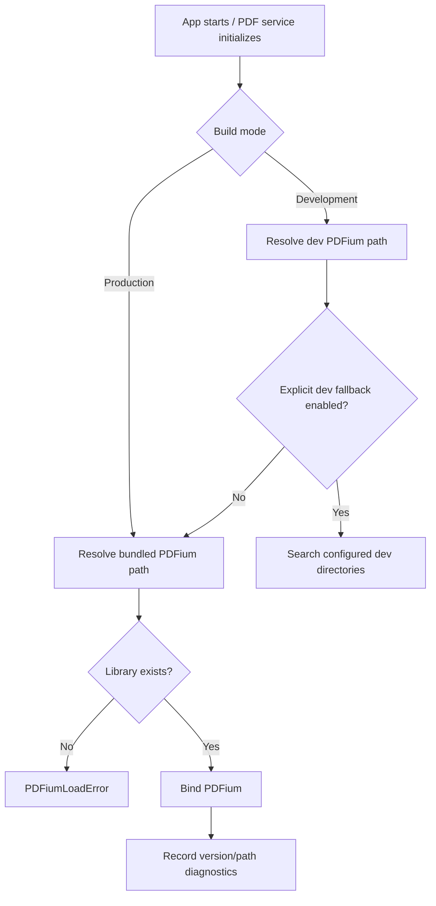

# RFC-003 — PDFium Loader and Bundled Dynamic Distribution

## 1. Summary

This RFC defines the first production PDFium distribution strategy for the migrated app: bundled dynamic PDFium managed by the application. The app must not require users to manually place PDFium in an external `lib/pdfium/lib` directory.

Static linking is explicitly deferred.

## 2. Motivation

The current architecture depends on an external PDFium library file for Rust/PDFium features while PDF.js handles page rendering. In the target architecture, PDFium is central to opening, rendering, searching, and highlights. If PDFium loading is brittle, the whole app is brittle.

Therefore PDFium packaging is a product feature, not a build detail.

## 3. Goals

- Define how PDFium is bundled, located, loaded, and diagnosed.
- Support development and packaged execution without manual user setup.
- Prevent unsafe arbitrary library loading in production.
- Provide a smoke-testable loading path.

## 4. Non-Goals

- Fully static PDFium linking.
- Downloading PDFium at app runtime.
- Supporting arbitrary user-provided PDFium in production by default.
- Rendering pages; covered by RFC-005 and later.

## 5. Strategy Decision

Adopt this staged strategy:

```text
Stage 1: Development loader with explicit dev fallback
Stage 2: Bundled dynamic PDFium in app-controlled resource path
Stage 3: Optional extract-to-app-cache if platform packaging requires it
Stage 4: Future static PDFium linking investigation
```

## 6. Runtime Loading Policy



## 7. Platform Resource Layout

Target packaged layout should be explicit and testable.

### 7.1 Windows

```text
PDF Tile Viewer.exe
resources/
└── pdfium/
    └── windows-x86_64/
        └── pdfium.dll
```

### 7.2 Linux

```text
pdf-tile-viewer
resources/
└── pdfium/
    └── linux-x86_64/
        └── libpdfium.so
```

### 7.3 macOS

```text
PDF Tile Viewer.app/
└── Contents/
    ├── MacOS/pdf-tile-viewer
    └── Resources/pdfium/macos-universal-or-arch/libpdfium.dylib
```

Actual paths may follow Dioxus bundle conventions, but the final layout must be documented and verified by CI.

## 8. Loader Interface

```rust
pub struct PdfiumLoaderConfig {
    pub mode: PdfiumLoadMode,
    pub allow_dev_fallback: bool,
    pub bundled_resource_root: PathBuf,
    pub explicit_dev_path: Option<PathBuf>,
}

pub enum PdfiumLoadMode {
    ProductionBundled,
    Development,
    Test,
}

pub struct PdfiumLoadReport {
    pub resolved_path: PathBuf,
    pub platform: PlatformTriple,
    pub version: Option<String>,
    pub source: PdfiumLoadSource,
}

pub enum PdfiumLoadSource {
    BundledResource,
    ExtractedAppCache,
    ExplicitDevelopmentPath,
    TestFixturePath,
}
```

## 9. Production Security Rules

- Production must not search the current working directory for PDFium.
- Production must not silently load a library from `PATH` or user-writable random directories.
- If extraction is used, the destination must be app-controlled and versioned.
- The loaded path must be logged diagnostically but not necessarily shown in full to the user.
- A failed load must not crash the app; it should show a clear PDF engine initialization error.

## 10. Diagnostic UI

In development builds, the app may expose:

```text
PDF Engine
- Status: Loaded / Failed
- Source: Bundled / Development path / Test path
- Version: <PDFium version if available>
- Path: <full path in development only>
```

In production, full paths should be hidden unless diagnostic mode is explicitly enabled.

## 11. CI Smoke Test

Minimum test:

```text
1. Stage PDFium binary into expected resource directory.
2. Start a small test executable or integration test.
3. Bind PDFium.
4. Open a fixture PDF.
5. Read page count.
6. Exit successfully.
```

## 12. Acceptance Criteria

- App can load PDFium from an app-controlled bundled path on the primary development platform.
- There is no production requirement for users to manually copy PDFium into a project directory.
- Failed PDFium loading produces a clear recoverable error.
- The resolved load source is visible in diagnostics.
- CI or local scripts can verify the packaged PDFium layout.

## 13. Risks

| Risk | Severity | Mitigation |
|---|---:|---|
| Platform-specific library naming/linking issues | High | Test each target layout early; keep loader isolated. |
| Static linking distracts from migration | Medium | Defer to Future RFC-F01. |
| Loading from unsafe paths | High | Enforce production load-path policy. |
| PDFium binary licensing/provenance confusion | Medium | Record source and version in release docs. |

## 14. Open Questions

- Which PDFium binary provider will be used for official releases?
- Should the app extract bundled PDFium to a cache path or load it directly from resources?
- What is the minimum supported platform set for the first migrated release?
