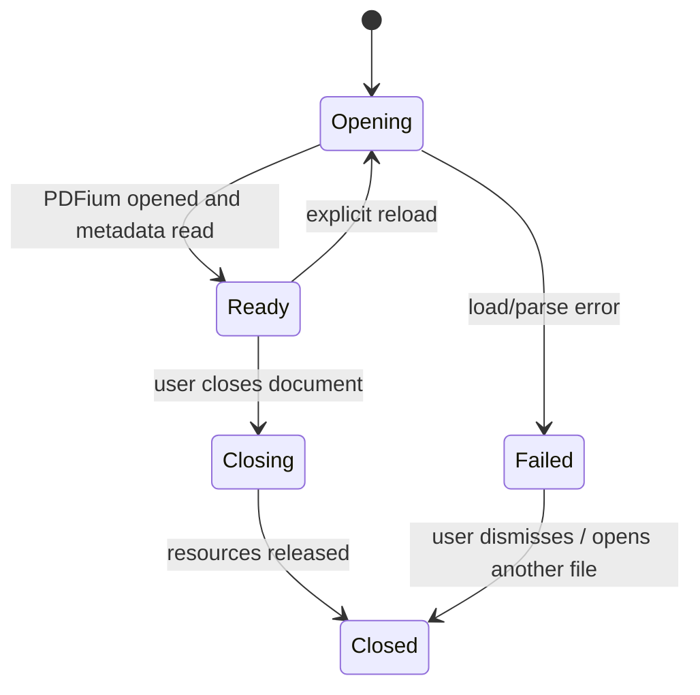
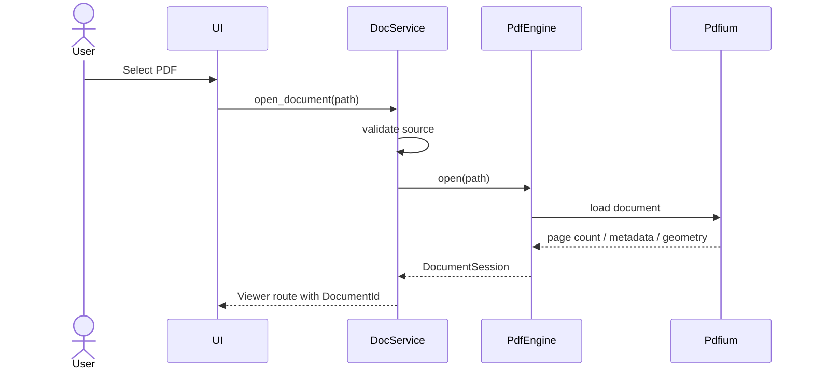

# RFC-004 — Document Session Model

## 1. Summary

This RFC defines the document session model for PDFs opened by the migrated app. A document session is the app-level representation of a PDF file: source path, metadata, page count, page geometry, render generation, search state, and lifetime.

This model is the contract between file intake, PDFium, tile rendering, search, zoom, and settings.

## 2. Motivation

The target architecture makes PDFium the authority for document structure and page rendering. The app needs a stable document/session abstraction so that UI code does not hold PDFium handles directly and rendering/search operations can be cancelled, refreshed, or invalidated safely.

## 3. Goals

- Define `DocumentId`, `DocumentSource`, and `DocumentSession`.
- Represent metadata and page geometry independent from Dioxus components.
- Define open, close, reload, and failure lifecycle.
- Establish generation counters for stale render/search result suppression.

## 4. Non-Goals

- Page bitmap cache details; covered by RFC-007.
- Search result structure; covered by RFC-010 and RFC-011.
- Password-protected PDF workflow.
- File watching and automatic reload on disk change.

## 5. Data Model

```rust
pub struct DocumentId(UuidLikeOrCounter);

pub struct DocumentSession {
    pub id: DocumentId,
    pub source: DocumentSource,
    pub display_name: String,
    pub metadata: DocumentMetadata,
    pub pages: Vec<PageDescriptor>,
    pub opened_at: SystemTime,
    pub generation: DocumentGeneration,
    pub state: DocumentState,
}

pub enum DocumentSource {
    LocalFile {
        path: PathBuf,
        fingerprint: FileFingerprint,
    },
}

pub struct FileFingerprint {
    pub size_bytes: u64,
    pub modified_at: Option<SystemTime>,
}

pub struct DocumentMetadata {
    pub title: Option<String>,
    pub author: Option<String>,
    pub subject: Option<String>,
    pub creator: Option<String>,
    pub producer: Option<String>,
    pub page_count: usize,
    pub encrypted: bool,
}

pub struct PageDescriptor {
    pub page_index: PageIndex,
    pub label: Option<String>,
    pub width_points: f32,
    pub height_points: f32,
    pub rotation_degrees: i32,
}

pub enum DocumentState {
    Opening,
    Ready,
    Failed(DocumentError),
    Closing,
    Closed,
}
```

## 6. Lifecycle



## 7. Generation Rules

`DocumentGeneration` must change when:

- A document is reopened.
- A different file is opened into the active viewer.
- Page descriptors are refreshed.
- Any operation invalidates render/search results.

Render and search results must include the generation they were computed against. If a result returns for an old generation, the UI must ignore it.

```rust
pub struct Generated<T> {
    pub document_id: DocumentId,
    pub generation: DocumentGeneration,
    pub value: T,
}
```

## 8. PDF Engine Ownership

The document session visible to UI/services is not the same as the native PDFium document handle.

```text
DocumentSession          = app/domain model
PdfiumDocumentHandle     = private PDF engine resource
```

The PDF engine should maintain an internal registry:

```rust
struct PdfEngineState {
    sessions: HashMap<DocumentId, PdfiumBackedSession>,
}

struct PdfiumBackedSession {
    public_session: DocumentSession,
    native_document: PdfiumDocument,
}
```

The exact type names are illustrative. The rule is that native document/page handles do not cross into Dioxus UI state.

## 9. Open Document Flow



## 10. Error Model

```rust
pub enum DocumentError {
    FileNotFound,
    FileNotReadable,
    UnsupportedFile,
    PdfiumUnavailable,
    PdfParseFailed,
    EncryptedUnsupported,
    TooLargeForPolicy,
    Unknown(String),
}
```

Errors must preserve internal diagnostic detail for logs while exposing stable user messages.

## 11. Page Geometry Rules

- Width and height are stored in PDF points or another clearly documented canonical unit.
- Rotation is stored per page.
- Layout code must not query PDFium directly for page size.
- Coordinate transform code must use the same page descriptors.

## 12. Acceptance Criteria

- Opening a fixture PDF creates a `DocumentSession` with correct page count and page descriptors.
- Closing a document releases native PDFium resources.
- UI state references documents by `DocumentId`, not native handles.
- Stale generation results are rejected.
- Encrypted or malformed PDFs return explicit errors rather than panicking.

## 13. Risks

| Risk | Mitigation |
|---|---|
| Native handles leak into UI state | Keep handle types private to `pdf_engine`. |
| Stale renders appear after reopening another file | Include `document_id` and `generation` in render/search results. |
| Page geometry mismatch breaks highlights | Canonicalize units and transformation rules in this RFC and RFC-011. |
