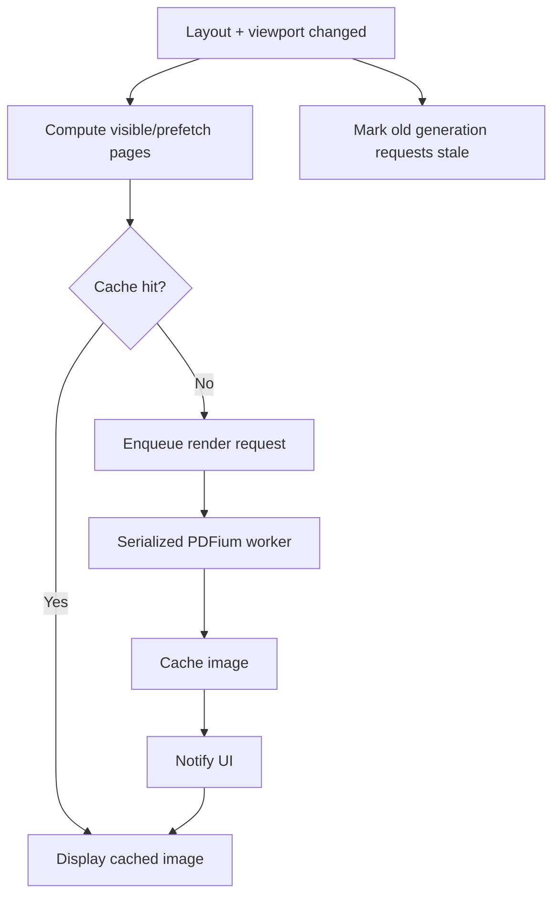

# RFC-007 — Lazy Render Queue and Cache

## 1. Summary

This RFC defines the lazy rendering queue and page image cache required for large PDFs. The app must not render every page immediately when a document opens. Instead, it should render visible and near-visible pages first, cache bounded results, and suppress stale renders after scale or document changes.

This RFC is mandatory before the migrated app can be considered suitable for large documents.

## 2. Motivation

PDF Tile Viewer’s value depends on viewing many pages, but rendering all pages at high scale can freeze the UI and consume excessive memory. Moving rendering to PDFium makes cache and scheduling policy even more important because page bitmaps are generated by the Rust engine and then transported into a WebView-based UI.

## 3. Goals

- Render visible and near-visible pages first.
- Avoid duplicate render work.
- Bound memory usage.
- Evict least useful page images.
- Invalidate stale renders on scale/layout/document changes.
- Keep UI responsive under large documents.

## 4. Non-Goals

- Persistent disk cache in the first release.
- GPU cache.
- Multi-document cache optimization.
- Perfect predictive prefetching.

## 5. Render Key

```rust
pub struct RenderCacheKey {
    pub document_id: DocumentId,
    pub document_generation: DocumentGeneration,
    pub page_index: PageIndex,
    pub scale_bucket: ScaleBucket,
    pub render_flags: RenderFlags,
}

pub struct RenderFlags {
    pub background: RenderBackground,
    pub include_baked_highlights: bool,
    pub rotation_policy: RotationPolicy,
}
```

Scale should be bucketed to prevent accidental cache fragmentation from tiny floating-point differences.

## 6. Cache Entry

```rust
pub struct RenderCacheEntry {
    pub key: RenderCacheKey,
    pub pixel_width: u32,
    pub pixel_height: u32,
    pub bytes_estimate: usize,
    pub image_ref: ImageRef,
    pub created_at: Instant,
    pub last_used_at: Instant,
    pub state: CacheEntryState,
}

pub enum CacheEntryState {
    Pending,
    Ready,
    Failed(RenderError),
}
```

`ImageRef` may be an in-memory registry key, cache URI, or file-backed temp reference depending on the chosen image transport.

## 7. Render Queue Priority

Render priority order:

1. Currently visible pages.
2. Pages immediately before and after the visible range.
3. Search-matched pages near the visible range.
4. Pages likely to be reached by scroll direction.
5. Low-priority thumbnails or distant pages.

```rust
pub enum RenderPriority {
    Visible,
    NearVisible,
    SearchRelevant,
    Predictive,
    Background,
}
```

## 8. Queue Lifecycle



## 9. Concurrency Model

PDFium access should be serialized through a worker or mutex-protected engine boundary. The render queue may accept many requests, but actual PDFium calls should be controlled.

Recommended design:

```text
RenderService
└── RenderQueue
    ├── request coalescing
    ├── priority ordering
    ├── stale generation suppression
    └── PdfEngineWorker access
```

## 10. Memory Budget

The app should define a default memory budget for rendered page images.

Example policy:

```text
default_render_cache_budget = 256 MB
minimum_budget = 64 MB
maximum_budget = 1024 MB or user-configurable advanced setting
```

Eviction candidate order:

1. Wrong document/generation.
2. Wrong scale bucket.
3. Far from visible viewport.
4. Least recently used.
5. Largest entries when pressure is high.

## 11. Placeholder States

Each tile should display one of:

```rust
enum TileImageState {
    NotRequested,
    Queued,
    Rendering,
    Ready(ImageRef),
    Failed(UserFacingError),
}
```

The UI should avoid flicker by retaining the old image briefly during scale changes if it does not mislead the user.

## 12. Acceptance Criteria

- Opening a 100-page PDF does not render all pages immediately.
- Visible pages render before non-visible pages.
- Scrolling triggers progressive rendering.
- Changing scale invalidates or rekeys renders correctly.
- Memory budget is enforced.
- Stale render results are ignored.
- Render queue behavior is testable without Dioxus.

## 13. Risks

| Risk | Severity | Mitigation |
|---|---:|---|
| Image transport duplicates memory | High | Prefer cache URI/registry over repeated data URIs before release. |
| Scroll causes render storm | High | Coalesce requests and throttle viewport updates. |
| Cache eviction removes visible pages | Medium | Prioritize visible pages as non-evictable under normal pressure. |
| PDFium worker becomes bottleneck | Medium | Accept serialization first; optimize scheduling before parallelism. |
