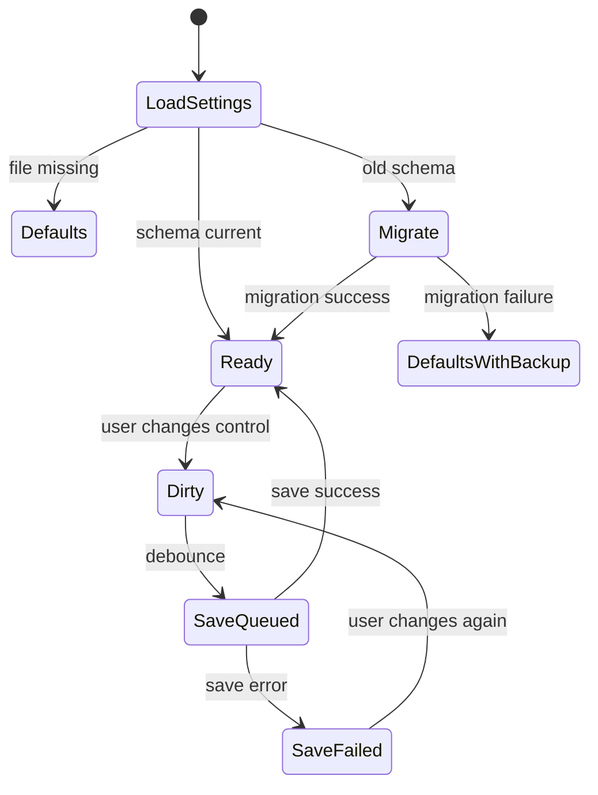

# RFC-008 — Viewer Controls and Persistent Settings

## 1. Summary

This RFC defines viewer controls and settings persistence for the migrated app. It restores scale, pages-per-row, page number visibility, jump-to-page, and related preferences from the current product while making the settings schema explicit and versioned.

## 2. Motivation

The viewer must remain controllable and predictable after the rendering migration. Users should be able to adjust tile density, zoom level, and page number visibility, and those preferences should persist across launches.

## 3. Goals

- Restore scale control.
- Restore auto/fixed pages-per-row control.
- Restore page number visibility toggle.
- Restore jump-to-page.
- Define versioned settings schema.
- Provide settings migration from legacy format where practical.

## 4. Non-Goals

- Cloud settings sync.
- Per-document persisted state for the first release.
- Complex preferences window.
- Editing PDF metadata.

## 5. Viewer Controls

```text
ViewerToolbar
├── Open / Back
├── Document title
├── Search button
├── Scale control
│   ├── Minus
│   ├── Slider
│   └── Plus
├── Pages-per-row control
│   ├── Auto
│   └── Fixed: 1..N
├── Page numbers toggle
├── Jump to page
├── Zen mode
└── More menu
    ├── Open in file manager
    └── Settings / diagnostics
```

## 6. Settings Schema

```rust
pub struct AppSettingsV1 {
    pub schema_version: u32,
    pub viewer: ViewerSettings,
    pub window: WindowSettings,
    pub privacy: PrivacySettings,
    pub advanced: AdvancedSettings,
}

pub struct ViewerSettings {
    pub default_scale: f32,
    pub pages_per_row: PagesPerRowPreference,
    pub show_page_numbers: bool,
    pub remember_last_view_mode: bool,
    pub zoom_overlay_alpha: Option<f32>,
}

pub enum PagesPerRowPreference {
    Auto,
    Fixed(u16),
}

pub struct WindowSettings {
    pub width: Option<u32>,
    pub height: Option<u32>,
    pub maximized: bool,
}

pub struct PrivacySettings {
    pub show_full_path_in_title: bool,
    pub persist_recent_files: bool,
}

pub struct AdvancedSettings {
    pub render_cache_budget_mb: Option<u32>,
    pub diagnostics_enabled: bool,
}
```

## 7. Settings Location

Settings must be stored in an app-specific configuration directory, not next to the executable unless platform constraints require otherwise.

Recommended conceptual path:

```text
<config_dir>/pdf-tile-viewer/settings.json
```

The actual implementation should use a platform app-dir helper.

## 8. Settings Lifecycle



## 9. Control Behavior

### 9.1 Scale

- Scale should use bounded values.
- Tiny floating-point variations should be bucketed for rendering.
- Ctrl + mouse wheel should adjust scale only when the viewer has focus and platform events support it reliably.

### 9.2 Pages Per Row

- Auto mode uses RFC-006 layout rules.
- Fixed mode supports a bounded range.
- The UI should make the active mode clear.

### 9.3 Jump to Page

- Accept page numbers in human one-based form.
- Convert to zero-based `PageIndex` internally.
- Reject out-of-range input with inline feedback.
- Scroll to the target and briefly mark the page.

## 10. Legacy Migration

If legacy settings can be found:

- Map scale to `viewer.default_scale`.
- Map page number visibility to `viewer.show_page_numbers`.
- Map fixed/auto pages-per-row to `viewer.pages_per_row`.
- Ignore obsolete Tauri/Svelte-only fields.

If migration fails, create a backup and use defaults.

## 11. Acceptance Criteria

- Scale, pages-per-row, and page number visibility are user-controllable.
- Settings persist across app restart.
- Invalid settings file falls back safely.
- Legacy settings migration is attempted if legacy file exists.
- Jump-to-page works with one-based input and handles invalid values.

## 12. Risks

| Risk | Mitigation |
|---|---|
| Settings writes too frequent | Debounce saves. |
| Bad settings break app startup | Validate and fallback to defaults. |
| Privacy leak through title/recent files | Add privacy defaults and RFC-016 enforcement. |
