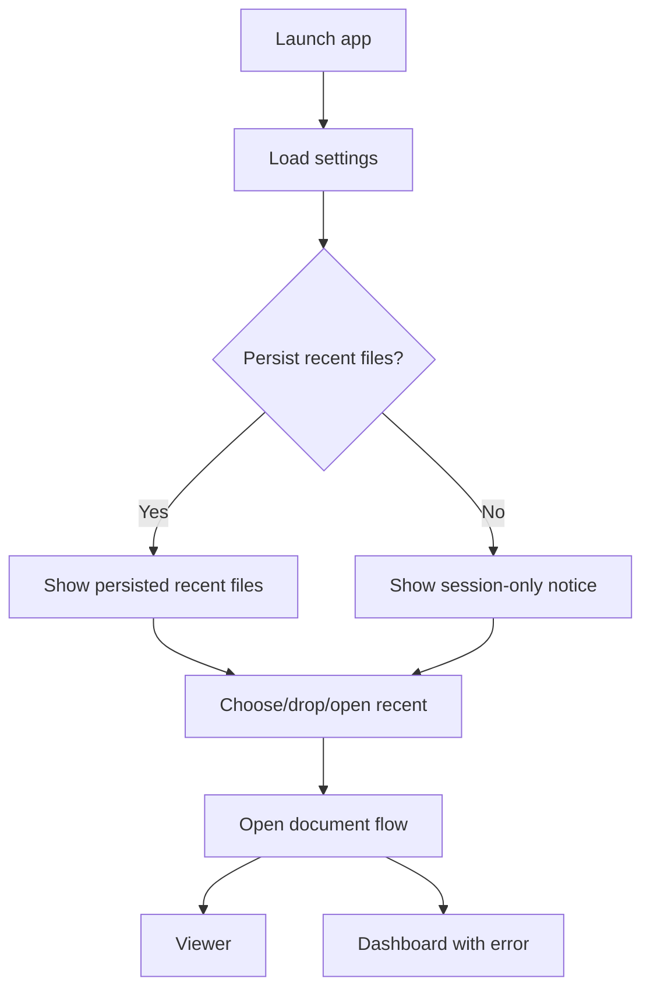

# RFC-009 — Dashboard and Session History UX

## 1. Summary

This RFC defines the dashboard and session history experience for the migrated Dioxus app. The dashboard is the initial screen where users open PDFs, drop files, and optionally reopen recent files.

## 2. Motivation

PDF Tile Viewer is a focused local desktop utility. The dashboard should help users start quickly without becoming a document manager. It should preserve the current app’s lightweight history behavior while introducing clearer privacy options for persisted recent files.

## 3. Goals

- Provide a clear empty state.
- Provide choose-file and drop-zone actions.
- Show session history during the current run.
- Optionally support persisted recent files if privacy setting allows it.
- Provide helpful error recovery after failed open.

## 4. Non-Goals

- Full library/catalog management.
- Folder scanning.
- Tags or favorites.
- Cloud-backed history.

## 5. Dashboard Layout

```text
DashboardScreen
├── Header
│   ├── App name: PDF Tile Viewer
│   └── Short value statement
├── OpenPdfCard
│   ├── Choose PDF button
│   ├── Drop zone
│   └── Supported file hint
├── RecentSection
│   ├── Session history list
│   └── Optional persisted recent files
└── Footer
    ├── Version
    └── Diagnostics link in development
```

## 6. Empty State Copy

Recommended copy:

```text
Open a PDF to view its pages as a tile overview.
Drop a PDF here or choose a file from your computer.
```

## 7. History Data Model

```rust
pub struct RecentDocumentEntry {
    pub id: RecentEntryId,
    pub display_name: String,
    pub path: PathBuf,
    pub opened_at: SystemTime,
    pub file_fingerprint: Option<FileFingerprint>,
    pub persisted: bool,
}

pub struct SessionHistory {
    pub entries: Vec<RecentDocumentEntry>,
    pub max_entries: usize,
}
```

## 8. History Rules

- The current run may keep session history regardless of persisted recent-file setting.
- Persisted recent files require `privacy.persist_recent_files = true`.
- Duplicate paths should move to the top rather than duplicate entries.
- Missing files should remain visible but marked as unavailable until removed or retried.
- Full paths should be hidden unless the user expands details or enables full path display.

## 9. Dashboard Flows



## 10. Error Recovery

If open fails from dashboard:

- Show a clear error toast or inline panel.
- Keep the user on the dashboard.
- Keep the failed item visible if it came from history, with an unavailable marker.
- Offer “Choose another PDF.”

## 11. Accessibility Requirements

- The drop zone must be keyboard-bypassable through the choose button.
- Recent files must be navigable with keyboard focus.
- Missing/unavailable status must not be conveyed only by color.

## 12. Acceptance Criteria

- Dashboard provides a clear open path from a cold start.
- Runtime history records successfully opened PDFs.
- Duplicate history entries collapse.
- Persisted recent files respect privacy setting.
- Missing recent files produce recoverable errors.

## 13. Risks

| Risk | Mitigation |
|---|---|
| Dashboard becomes too complex | Keep history small and secondary. |
| Recent files leak private paths | Hide full paths by default; allow disabling persisted history. |
| Failed history entry loops | Mark missing/unreadable entries and require explicit retry. |
