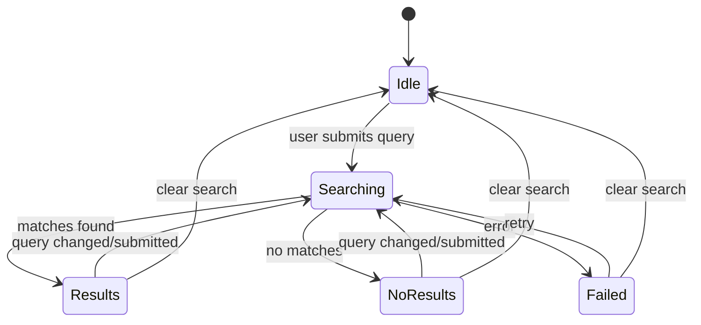

# RFC-010 — Search Result Model and Page Markers

## 1. Summary

This RFC defines the first-stage search feature for the migrated app: non-mutating PDFium text search that returns matched pages, counts, and tile markers. Exact rectangle highlights are deferred to RFC-011.

## 2. Motivation

The current app supports text search and visual indication of matched pages. In the target architecture, search should no longer mutate or rewrite PDF bytes for highlighting. Search results should be an application model layered over PDFium-extracted text matches.

Page-level markers provide useful search feedback before exact coordinate highlighting is implemented.

## 3. Goals

- Implement PDFium-backed text search.
- Return page-level matches and counts.
- Display matched-page markers in the tile grid.
- Show compact page ranges/list.
- Clear search without reopening the document.
- Avoid mutating PDF bytes.

## 4. Non-Goals

- Exact rectangle highlights; RFC-011.
- Regex search.
- Whole-document indexing cache.
- Search across multiple PDFs.

## 5. Search Query Model

```rust
pub struct SearchQuery {
    pub text: String,
    pub case_sensitive: bool,
    pub whole_word: bool,
}

pub struct SearchRequest {
    pub document_id: DocumentId,
    pub generation: DocumentGeneration,
    pub query: SearchQuery,
}
```

Initial UI may expose only plain text search, with case/whole-word options hidden or deferred.

## 6. Search Result Model

```rust
pub struct SearchResultSet {
    pub document_id: DocumentId,
    pub generation: DocumentGeneration,
    pub query: SearchQuery,
    pub pages: Vec<PageSearchSummary>,
    pub total_matches: usize,
    pub searched_at: SystemTime,
}

pub struct PageSearchSummary {
    pub page_index: PageIndex,
    pub match_count: usize,
}
```

## 7. UI Behavior

```text
SearchPanel
├── Search input
├── Search button / Enter key
├── Clear button
├── Summary: “12 matches on 5 pages”
├── Matched pages: “1, 4–6, 10”
└── Optional result page list
```

Tile behavior:

- Matched pages receive a visible marker.
- Marker should include count if practical.
- Marker must be visible in normal and Zen mode unless search panel is cleared.

## 8. Search Lifecycle



## 9. Minimum Query Policy

Recommended default:

- Ignore empty queries.
- Require at least 2 visible characters for normal search.
- Allow 1 character only if explicitly submitted and document is small, or if product owner approves.

This avoids expensive accidental searches.

## 10. Compact Page Formatting

Matched pages should be displayed one-based to the user.

Example:

```text
Internal pages: [0, 3, 4, 5, 9]
Display: 1, 4–6, 10
```

## 11. Non-Mutating Rule

Search must not alter the PDF file or create modified PDF bytes. Search result state is app-owned and can be cleared independently from the document session.

## 12. Acceptance Criteria

- Searching a fixture term returns expected page indices and counts.
- Matched tiles show a visible marker.
- No-match state is clear.
- Clearing search removes markers.
- Search results include document generation and stale results are ignored.
- PDF bytes are not modified during search.

## 13. Risks

| Risk | Mitigation |
|---|---|
| Search on large PDFs blocks UI | Run through PDF engine worker and show progress/busy state. |
| PDFium text extraction differs from PDF.js | Accept PDFium as target authority; add fixture tests. |
| User expects exact highlights immediately | Make page markers useful and add RFC-011 next. |
