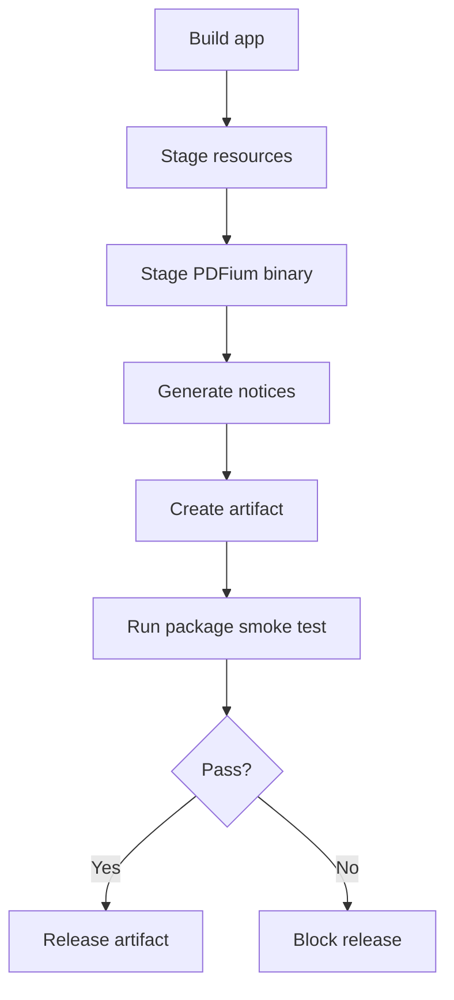

# RFC-014 — Cross-Platform Packaging and Release Artifacts

## 1. Summary

This RFC defines packaging and release artifact requirements for the migrated Dioxus + PDFium application. A release is not complete until users can launch the app without manually installing PDFium.

## 2. Motivation

The migration removes the old external PDFium file requirement by making PDFium internally managed. Packaging must verify that the app, resources, PDFium dynamic library, license notices, and documentation are all delivered coherently across supported platforms.

## 3. Goals

- Define supported release artifacts.
- Bundle dynamic PDFium per platform.
- Verify packaged app can bind PDFium.
- Document unsigned-app behavior if applicable.
- Provide user-facing release notes and troubleshooting.

## 4. Non-Goals

- Static PDFium linking.
- App store distribution.
- Paid code-signing policy decision.
- Auto-update system.

## 5. Supported Artifact Matrix

Initial recommended artifacts:

| Platform | Artifact | Notes |
|---|---|---|
| Windows x86_64 | `.zip` or installer | Must include `pdfium.dll`. |
| Linux x86_64 | `.tar.gz` or AppImage if chosen | Must include `libpdfium.so`. |
| macOS arm64/x86_64 | `.zip` or `.dmg` | Must include `libpdfium.dylib`; signing/notarization policy documented. |

The project may reduce the first release matrix, but the chosen matrix must be explicit.

## 6. Required Package Contents

```text
Application binary / bundle
PDFium dynamic library
Static assets
License file
Third-party notices
README or quick start
Troubleshooting notes
Version metadata
```

## 7. Package Verification Flow



## 8. Version Metadata

The packaged app should be able to report:

```rust
pub struct BuildInfo {
    pub app_version: String,
    pub git_commit: Option<String>,
    pub build_profile: String,
    pub target_triple: String,
    pub pdfium_source: String,
    pub pdfium_version: Option<String>,
}
```

## 9. Release Documentation

Each release should document:

- Supported OS/architecture.
- Whether the artifact is signed.
- Whether users may see OS security prompts.
- How PDFium is bundled.
- Known limitations.
- How to report PDF rendering/search issues.

## 10. Unsigned-App Policy

If avoiding paid code signing remains the project policy, release notes must be honest and clear. Do not hide platform warnings. Explain how users can verify checksums and source provenance.

## 11. Acceptance Criteria

- A clean environment can launch the packaged app.
- Packaged app can load PDFium without manual setup.
- Fixture PDF can be opened and rendered in the packaged layout.
- Release artifact contains license and third-party notices.
- Artifact structure is documented.
- Checksums are generated for release artifacts.

## 12. Risks

| Risk | Severity | Mitigation |
|---|---:|---|
| PDFium not found after packaging | High | Package smoke test must bind PDFium. |
| OS security prompts confuse users | Medium | Document unsigned status and checksums. |
| Third-party notices incomplete | Medium | Track PDFium binary source and licenses. |
| Platform packaging drift | Medium | Keep artifact layout tests in CI. |
