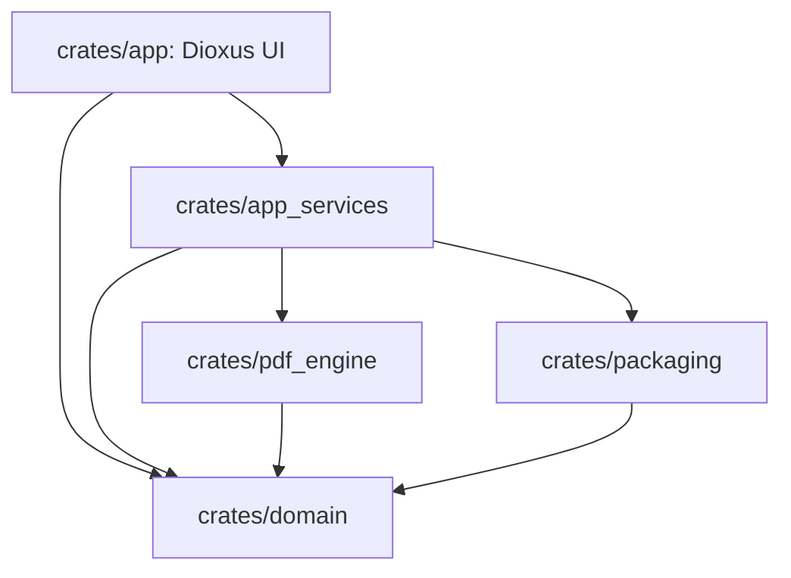

# RFC-001 — Dioxus Application Shell and Workspace Layout

## 1. Summary

This RFC defines the new Dioxus-based desktop application shell and Rust workspace layout for PDF Tile Viewer. It establishes the migration foundation: a runnable Dioxus Desktop app, a clean module boundary between UI and PDF services, and a workspace organization that prevents the old Tauri/Svelte command boundary from being recreated unnecessarily.

The first implementation of this RFC must compile and launch even before any PDF rendering is available.

## 2. Motivation

The current app is split between Svelte UI state, PDF.js page rendering, and Tauri commands that call Rust/PDFium for selected operations. The target app should be Rust-first: Dioxus owns UI composition and state, while Rust services own document, rendering, settings, and platform behavior.

A disciplined workspace layout is needed before the rendering pipeline begins. Without it, the migration could become a mixed rewrite where UI components directly call PDFium, rendering code depends on Dioxus, or legacy Tauri command shapes are copied into the new design.

## 3. Goals

- Create a new Rust workspace suitable for Dioxus Desktop.
- Define crate responsibilities and dependency direction.
- Provide the basic app frame, routing model, dashboard shell, toast area, and loading indicators.
- Establish the event/state style for future viewer features.
- Keep PDF engine details out of Dioxus components.
- Route all user-visible UI strings through the i18n catalog defined by RFC 017 from the very first screen, so multilingual support is structural rather than retrofitted.
- Keep `domain` and the service boundaries free of native-only assumptions so a future Dioxus web (offline web app / WASM) target can reuse them with an alternate PDF engine backend (see Future RFC-F06).

## 3.1 Project Coding Constraints (binding for all migration RFCs)

These constraints come from the project development guidelines and apply to every crate created under this RFC set:

- **Rust 2024 edition** for all workspace crates.
- **Rust 2018+ module style**: submodules live in `foo.rs` plus an optional `foo/` directory; `mod.rs` files are not used.
- **File size limits**: consider splitting a `.rs` file above **300 effective lines of code (ELOC)**; splitting is strongly recommended above **500 ELOC**. The same rule applies to test files.
- **Test organization**: test code inside `src/` lives in a `tests.rs` file (`#[cfg(test)] mod tests;`), with submodules under `src/tests/` when it grows. Tests validate the design specifications in these RFCs, not merely the written code.
- **Language**: all documentation and code comments are written in English.

## 4. Non-Goals

- Rendering PDF pages.
- Implementing search.
- Implementing final packaging.
- Migrating all settings.
- Solving static PDFium linking.

## 5. User-Facing Behavior

At the end of this RFC, launching the app displays a dashboard-like screen with the app name, an empty-state message, and disabled or placeholder file-open controls if RFC-002 is not complete yet.

The app should feel like the beginning of the final product, not a blank technical demo.

## 6. Proposed Workspace Layout

```text
pdf-tile-viewer/
├── Cargo.toml
├── Dioxus.toml
├── README.md
├── LICENSE
├── crates/
│   ├── app/
│   │   ├── Cargo.toml
│   │   └── src/
│   │       ├── main.rs
│   │       ├── app.rs
│   │       ├── routes.rs
│   │       ├── state.rs
│   │       ├── screens/
│   │       │   ├── dashboard.rs
│   │       │   └── viewer.rs
│   │       ├── components/
│   │       │   ├── app_shell.rs
│   │       │   ├── toolbar.rs
│   │       │   ├── toast.rs
│   │       │   ├── loading.rs
│   │       │   └── error_panel.rs
│   │       └── assets/
│   ├── domain/
│   ├── app_services/
│   ├── pdf_engine/
│   └── packaging/
└── docs/
```

## 7. Dependency Direction



Rules:

1. `domain` must not depend on Dioxus, PDFium, or platform GUI APIs.
2. `pdf_engine` must not depend on Dioxus components.
3. `app` may call `app_services`, but should not call raw PDFium binding functions.
4. `packaging` may contain OS-specific PDFium location logic but must not decide viewer behavior.

## 8. App State Model

Initial global state:

```rust
struct AppState {
    route: AppRoute,
    active_document: Option<DocumentId>,
    ui_mode: UiMode,
    busy: BusyState,
    toasts: Vec<ToastMessage>,
}

enum AppRoute {
    Dashboard,
    Viewer { document_id: DocumentId },
}

enum UiMode {
    Normal,
    Zen,
}

enum BusyState {
    Idle,
    OpeningFile,
    LoadingDocument,
    Rendering,
}
```

The exact Rust shape may change, but the concepts must remain explicit.

## 9. Component Hierarchy

```text
AppRoot
└── AppShell
    ├── TitleBarArea
    ├── GlobalToastRegion
    ├── RouteHost
    │   ├── DashboardScreen
    │   │   ├── AppIntro
    │   │   ├── OpenPdfCard
    │   │   └── RecentSessionList
    │   └── ViewerScreen
    │       ├── ViewerToolbar
    │       ├── SearchPanelSlot
    │       ├── TileViewportSlot
    │       └── StatusBar
    └── GlobalOverlayHost
        ├── BusyOverlay
        └── ModalHost
```

`ViewerScreen` may initially be a placeholder until later RFCs land.

## 10. Styling and Theming Rules

- Prefer CSS variables or a small style module over ad hoc inline styles.
- Define semantic tokens: background, panel, border, text-primary, text-muted, accent, danger, focus-ring.
- Use accessible contrast by default.
- Avoid product behavior depending on CSS layout side effects.

## 11. Error and Toast Model

```rust
enum ToastKind {
    Info,
    Success,
    Warning,
    Error,
}

struct ToastMessage {
    id: ToastId,
    kind: ToastKind,
    title: String,
    body: Option<String>,
    dismissible: bool,
}
```

Errors must be user-readable at the app-service boundary. Low-level errors may be logged, but the UI should display a stable message such as “PDFium could not be loaded” or “This file could not be opened as a PDF.”

## 12. Dioxus Boundary Policy

Dioxus components may:

- Read signals/state.
- Dispatch UI events to services.
- Render components.
- Render service results.

Dioxus components must not:

- Store raw PDFium document/page handles.
- Open files directly except through the file-intake service.
- Mutate settings files directly.
- Decide PDF cache eviction rules.

## 13. Acceptance Criteria

- `cargo check --workspace` succeeds.
- The app launches as a Dioxus Desktop app.
- The dashboard screen is visible.
- The component hierarchy includes app shell, route host, toast region, and placeholder viewer route.
- Crate dependency direction follows the architecture above.
- No Tauri command or Svelte store compatibility layer is introduced.

## 14. Implementation Notes

Start with minimal components and avoid building the final visual polish during this RFC. The goal is to make all later RFCs land in the right architecture.

## 15. Risks

| Risk | Mitigation |
|---|---|
| Dioxus version churn | Pin the Dioxus version and avoid unstable APIs in core state. |
| UI code grows into service code | Enforce crate boundaries and review imports. |
| Legacy command shapes reappear | Prefer domain service methods over stringly command names. |

## 16. Open Questions

- Which exact Dioxus version is pinned for the migration branch?
  **Resolved at adoption:** pin the latest stable Dioxus 0.7.x line (0.7.9 at adoption time) in the workspace `Cargo.toml`; bumping to a newer minor/major line requires a follow-up note in `CHANGELOG.md`.
- Should the old Tauri app remain in the same repository under a feature flag or be archived before migration?
  **Resolved at adoption:** the migration starts in a fresh Cargo workspace; the v1.1.2 Tauri/Svelte tree is kept only as the reverse-engineered design reference under `docs/`, not as buildable code in this repository.
