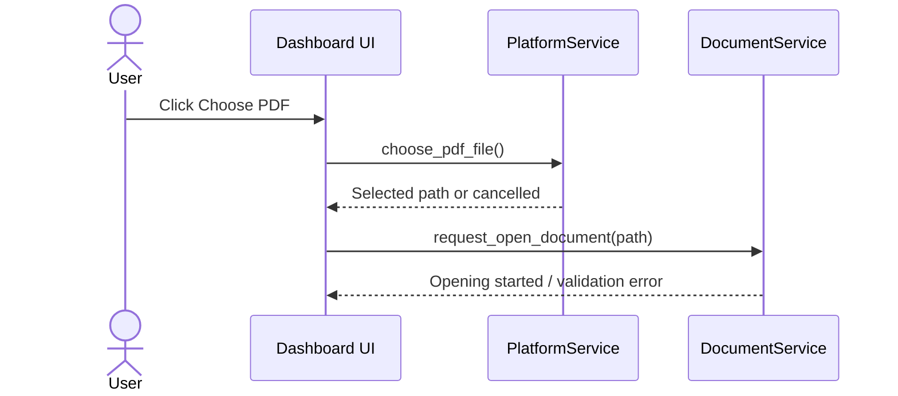
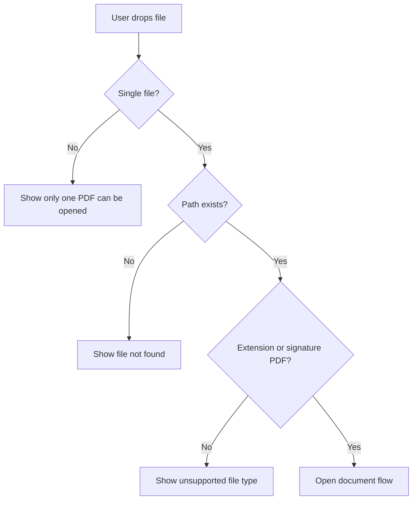

# RFC-002 — Platform File Picker, Drag-Drop, and File Manager Integration

## 1. Summary

This RFC defines how users select PDF files, drop PDF files into the app, and open the containing folder from the migrated Dioxus application.

The feature replaces the current Tauri dialog and shell helpers with a Rust-first platform service. It must preserve the basic user workflow: choose a PDF, drag a PDF onto the app, and open the file location from the viewer.

## 2. Motivation

File intake is the first user-visible workflow in the viewer. It must be solved before document sessions and rendering can be tested in realistic conditions.

The design must avoid mixing platform-specific code into UI components. It should also validate user-selected files before handing them to PDFium.

## 3. Goals

- Provide a file picker for PDF selection.
- Provide drag-and-drop intake where Dioxus Desktop/platform support is adequate.
- Validate selected path before opening as a document.
- Provide an “open containing folder” action.
- Return consistent user-facing errors.

## 4. Non-Goals

- Multi-document tabs.
- Importing directories.
- Persisted recent files; session history is enough until RFC-009.
- Watching file changes on disk.

## 5. User Workflows

### 5.1 Choose PDF



### 5.2 Drag and Drop



### 5.3 Open Containing Folder

The viewer toolbar should expose a button or menu item:

```text
Open in File Manager
```

Expected behavior:

- Open parent folder if the original path exists.
- If supported by the platform, select/reveal the file.
- If reveal is not supported, open the parent directory.
- If the file no longer exists, show a recoverable warning.

## 6. Service Interface

```rust
pub trait PlatformFileService {
    async fn choose_pdf_file(&self) -> Result<Option<PathBuf>, PlatformError>;
    async fn reveal_in_file_manager(&self, path: &Path) -> Result<(), PlatformError>;
    fn validate_pdf_candidate(&self, path: &Path) -> Result<PdfCandidate, FileIntakeError>;
}

pub struct PdfCandidate {
    pub path: PathBuf,
    pub display_name: String,
    pub file_size_bytes: u64,
    pub last_modified: Option<SystemTime>,
}
```

## 7. Validation Rules

Minimum validation before PDFium load:

1. Path exists.
2. Path is a regular file.
3. File is readable.
4. File size is greater than zero.
5. File extension is `.pdf` or file header begins with `%PDF-`.

Extension-only rejection should be avoided when the signature indicates a PDF. Signature validation should read only a small header prefix.

## 8. Error Messages

| Condition | User message |
|---|---|
| User cancels picker | No message required. |
| File does not exist | “The selected file no longer exists.” |
| Directory selected | “Please select a PDF file, not a folder.” |
| Not readable | “The selected file cannot be read.” |
| Empty file | “The selected file is empty.” |
| Not PDF-like | “This file does not look like a PDF.” |
| File manager open failed | “The file location could not be opened.” |

## 9. UI Placement

```text
DashboardScreen
└── OpenPdfCard
    ├── Choose PDF button
    ├── Drop zone
    └── Small hint: “Drop a PDF here or choose a file.”

ViewerToolbar
└── File menu / secondary action
    └── Open in File Manager
```

## 10. Accessibility Requirements

- The drop zone must not be the only way to open a PDF.
- The choose button must have a clear label.
- Drag-over state should be visually clear but not rely only on color.
- Errors must be announced in the toast region or error panel.

## 11. Acceptance Criteria

- User can open a native file picker and select a PDF path.
- Cancelling the picker leaves the dashboard unchanged.
- Dragging a single PDF triggers the same validation/open flow.
- Invalid dropped files produce clear messages.
- Viewer can open the containing folder for an opened document.
- File path validation is tested independently of Dioxus components.

## 12. Risks

| Risk | Mitigation |
|---|---|
| Dioxus drag/drop APIs differ across platforms | Implement choose-file first; keep drag/drop feature-gated if needed. |
| File manager reveal is inconsistent | Fallback to opening parent directory. |
| Paths leak in screenshots or title | RFC-016 defines privacy settings. |
