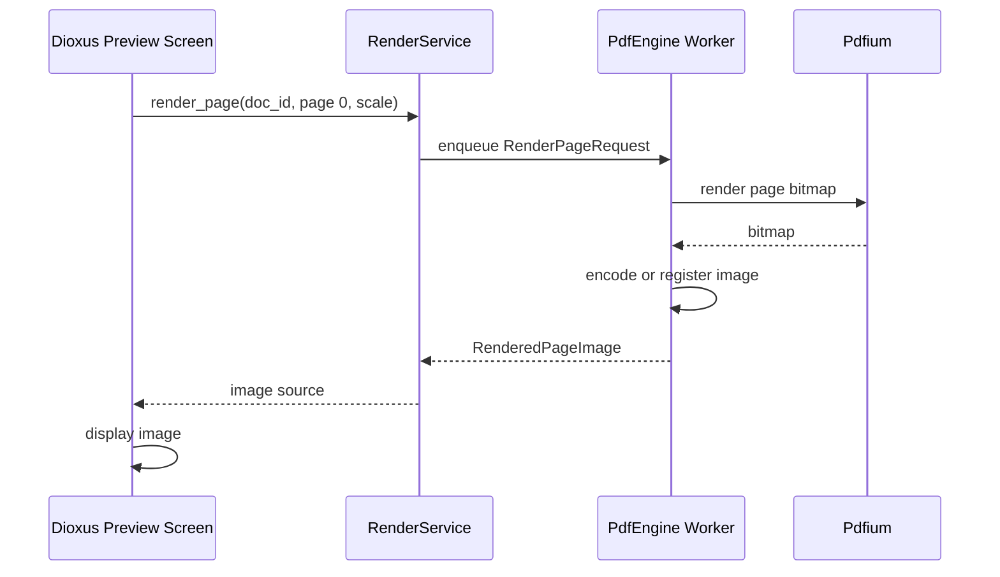

# RFC-005 — Single-Page Render Vertical Slice

## 1. Summary

This RFC defines the minimum vertical slice that proves the target rendering architecture: open a PDF through PDFium, render one page to a bitmap, and display that bitmap in the Dioxus UI.

This RFC is a mandatory migration gate. Full tile layout, lazy rendering, search, and zoom should not begin until this slice is working.

## 2. Motivation

The migration’s largest technical shift is replacing PDF.js rendering with Rust/PDFium bitmap rendering. A small single-page slice validates PDFium binding, document session creation, bitmap rendering, image encoding/transport, and Dioxus display before the app invests in full UI parity.

## 3. Goals

- Render page 1 of an opened PDF using PDFium.
- Display the rendered page in Dioxus.
- Prove the first image transport mechanism.
- Keep the app responsive during rendering.
- Establish the shape of render errors.

## 4. Non-Goals

- Rendering all pages.
- Tile layout.
- Render cache eviction.
- Search highlights.
- GPU acceleration.

## 5. User-Facing Behavior

After choosing a PDF, the user sees a simple preview screen:

```text
┌────────────────────────────────────────────┐
│ PDF Tile Viewer                            │
├────────────────────────────────────────────┤
│ Loaded: sample.pdf                         │
│ Pages: 12                                  │
│                                            │
│ ┌────────────────────────────────────────┐ │
│ │                                        │ │
│ │          Rendered Page 1               │ │
│ │                                        │ │
│ └────────────────────────────────────────┘ │
│                                            │
│ [Back to Dashboard]                        │
└────────────────────────────────────────────┘
```

If rendering fails, the user sees a recoverable error and can return to the dashboard.

## 6. Render Request Model

```rust
pub struct RenderPageRequest {
    pub document_id: DocumentId,
    pub generation: DocumentGeneration,
    pub page_index: PageIndex,
    pub scale: RenderScale,
    pub background: RenderBackground,
    pub format: RenderOutputFormat,
}

pub enum RenderOutputFormat {
    Png,
    RawRgba,
}

pub struct RenderedPageImage {
    pub document_id: DocumentId,
    pub generation: DocumentGeneration,
    pub page_index: PageIndex,
    pub pixel_width: u32,
    pub pixel_height: u32,
    pub scale: RenderScale,
    pub payload: RenderedImagePayload,
}

pub enum RenderedImagePayload {
    DataUri(String),       // spike acceptable only
    Bytes(Vec<u8>),        // service result
    CacheUri(String),      // preferred for later RFCs
}
```

## 7. Image Transport Policy

For RFC-005, a PNG data URI is acceptable as a spike implementation because it is simple and proves the rendering path. However, the implementation must label it as provisional.

Before release, RFC-007 or RFC-014 should decide whether to use:

- In-memory image URL registry.
- Custom protocol/resource handler.
- File-backed temporary image cache.
- Direct webview-compatible asset path.

## 8. Rendering Flow



## 9. Responsiveness Requirement

Rendering must not block Dioxus event handling. The render call should run through an async task, background worker, or service queue.

The preview screen must show one of these states:

```rust
enum PreviewState {
    LoadingDocument,
    RenderingPage,
    Ready(RenderedPageImage),
    Failed(UserFacingError),
}
```

## 10. Error Handling

| Condition | UI behavior |
|---|---|
| PDFium unavailable | Show PDF engine error and dashboard action. |
| Page index invalid | Show internal consistency error; do not crash. |
| Render fails | Show render failed message. |
| Image encoding fails | Show render output error. |
| Stale result | Ignore silently or log diagnostic. |

## 11. Test Fixture

At least one small fixture PDF should be added to the repository for testing. The test must confirm:

- Document opens.
- Page count is greater than zero.
- Page 0 renders successfully.
- Rendered pixel dimensions are non-zero.

## 12. Acceptance Criteria

- User can choose a PDF and see page 1 rendered by PDFium.
- App remains responsive during rendering.
- Rendering result includes document id and generation.
- Stale generation results are ignored.
- At least one automated test renders a fixture page.
- The chosen image transport method is documented as either provisional or release-ready.

## 13. Risks

| Risk | Severity | Mitigation |
|---|---:|---|
| Data URI memory overhead | Medium | Accept only for slice; replace before large PDF support. |
| Render call blocks UI | High | Use service queue/background task. |
| Pixel dimensions too large | Medium | Start with conservative default scale. |
