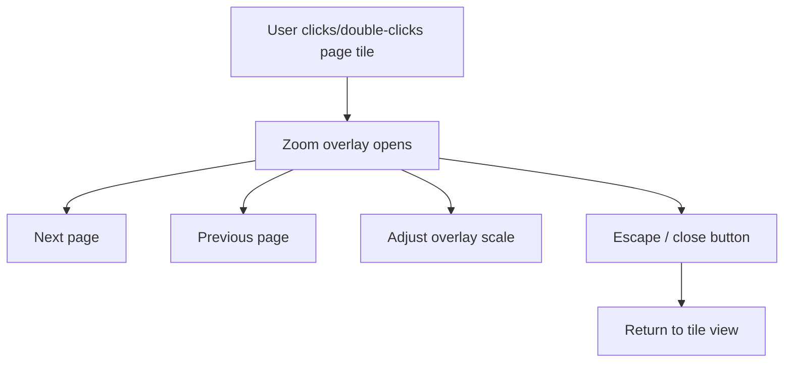

# RFC-012 — Zoom Overlay

## 1. Summary

This RFC defines the zoom overlay used for focused inspection of a single page. It restores the current app’s “click/tile zoom” workflow while adapting it to the PDFium-rendered image pipeline.

## 2. Motivation

The tile overview is useful for scanning many pages, but users need a way to inspect one page at larger scale without leaving the tile context. The zoom overlay should be fast, reversible, keyboard-friendly, and consistent with search highlights.

## 3. Goals

- Open a page in zoom overlay from a tile.
- Navigate previous/next page inside overlay.
- Support independent overlay zoom scale.
- Preserve or redesign background lock/transparency behavior.
- Support search highlights in zoom view.
- Provide Escape-to-close and keyboard navigation.

## 4. Non-Goals

- Full-screen OS mode.
- Separate window mode.
- Editing PDF content.
- Text selection.

## 5. User Workflow



## 6. Overlay State

```rust
pub struct ZoomOverlayState {
    pub document_id: DocumentId,
    pub generation: DocumentGeneration,
    pub page_index: PageIndex,
    pub scale: ZoomScale,
    pub background_policy: ZoomBackgroundPolicy,
    pub is_open: bool,
}

pub enum ZoomBackgroundPolicy {
    Dimmed,
    LockedTileView,
    Transparent { alpha: f32 },
}
```

## 7. Rendering Policy

The overlay should request a render appropriate for the overlay scale. It may temporarily show the tile image while the higher-resolution overlay image is loading.

```text
Open overlay
    ↓
Show existing tile image if available
    ↓
Request overlay-scale render
    ↓
Replace with higher-resolution image
    ↓
Apply search highlight overlay if active
```

## 8. UI Structure

```text
ZoomOverlay
├── Backdrop
├── OverlayPanel
│   ├── Header
│   │   ├── Page indicator: “Page 12 / 80”
│   │   ├── Scale control
│   │   └── Close button
│   ├── PageImageContainer
│   │   ├── Rendered page image
│   │   └── Highlight overlay
│   └── Footer / Navigation
│       ├── Previous page
│       └── Next page
```

## 9. Keyboard Behavior

| Key | Behavior |
|---|---|
| Escape | Close overlay |
| ArrowLeft / PageUp | Previous page |
| ArrowRight / PageDown | Next page |
| + / = | Increase overlay scale |
| - | Decrease overlay scale |
| Home | First page |
| End | Last page |

Keyboard shortcuts must not conflict with text input fields when focus is inside an input.

## 10. Boundary Behavior

- Previous is disabled on first page.
- Next is disabled on last page.
- If the underlying document closes, overlay closes automatically.
- If render fails, overlay displays an error for that page and keeps navigation available.

## 11. Acceptance Criteria

- User can open zoom overlay from a page tile.
- Overlay shows the correct page number.
- Previous/next navigation works.
- Escape closes overlay and returns focus to the originating tile if possible.
- Overlay render uses generation-aware cache/request keys.
- Search highlights align in overlay if RFC-011 is implemented.

## 12. Risks

| Risk | Mitigation |
|---|---|
| Overlay render consumes too much memory | Use separate scale bucket and cache budget accounting. |
| Focus is lost after close | Store origin tile id and restore focus best-effort. |
| Transparency is visually confusing | Default to dimmed/locked background; keep transparency optional. |
