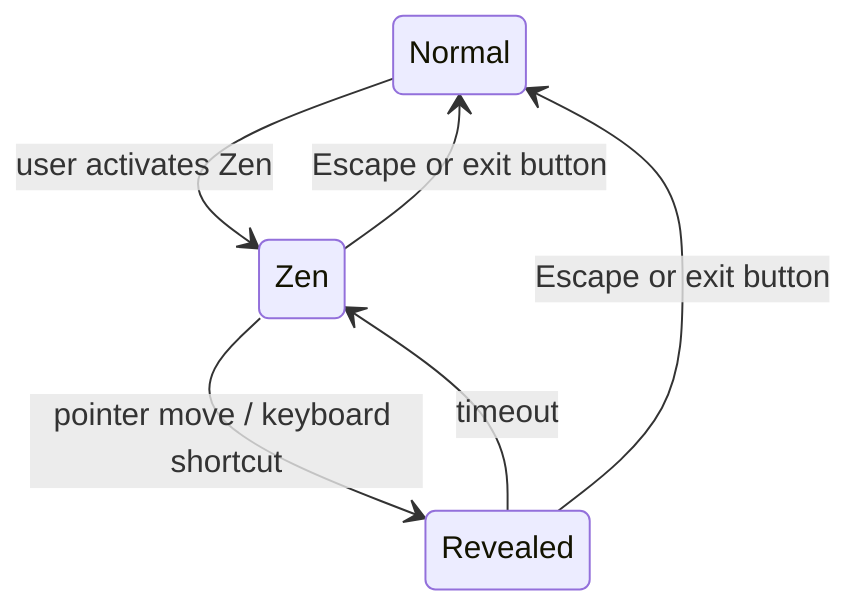

# RFC-013 — Zen Mode and Keyboard Accessibility

## 1. Summary

This RFC defines Zen mode and keyboard/accessibility behavior for the migrated viewer. Zen mode provides a distraction-free tile view by hiding nonessential chrome. Keyboard accessibility ensures users can operate core viewer workflows without relying exclusively on pointer input.

## 2. Motivation

The current app includes a Zen-like focused viewing mode. The migrated version should preserve this value but make it clearer and safer: Zen mode must be reversible, keyboard-operable, and not trap users.

## 3. Goals

- Restore Zen mode as a UI state.
- Define which controls are hidden or revealed.
- Define keyboard shortcuts for core viewer operations.
- Ensure focus indicators and labels exist.
- Ensure search, jump, and overlay workflows are keyboard-friendly.

## 4. Non-Goals

- Screen-reader optimized text extraction layer.
- Full document semantic reading mode.
- Replacing OS-level accessibility tools.

## 5. Zen Mode Behavior

Zen mode hides or minimizes:

- Dashboard navigation.
- Toolbar chrome.
- Secondary panels.
- Footer/status noise.

Zen mode preserves:

- Tile viewport.
- Page numbers if setting is enabled.
- Search markers/highlights if search is active.
- Minimal exit affordance.

## 6. Zen Mode State

```rust
pub enum UiMode {
    Normal,
    Zen,
}

pub struct ZenModeState {
    pub entered_at: Instant,
    pub reveal_controls: bool,
    pub last_pointer_moved_at: Option<Instant>,
}
```

## 7. Zen Mode Interaction



Escape behavior:

1. If zoom overlay is open, close zoom overlay first.
2. Else if Zen mode is active, exit Zen mode.
3. Else no global action unless defined by current focused component.

## 8. Keyboard Shortcuts

| Shortcut | Behavior |
|---|---|
| Ctrl/Cmd + O | Open PDF |
| Ctrl/Cmd + F | Focus search |
| Escape | Close overlay / exit Zen / clear transient UI |
| + / = | Increase viewer scale when viewer focused |
| - | Decrease viewer scale when viewer focused |
| 0 | Reset scale to default when viewer focused |
| G or Ctrl/Cmd + G | Focus jump-to-page |
| Z | Toggle Zen mode when viewer focused |
| Enter on tile | Open zoom overlay |
| Arrow keys in overlay | Navigate pages |

Shortcuts must be disabled or adjusted when focus is inside text input.

## 9. Accessibility Requirements

- Buttons must have accessible labels.
- Icon-only buttons need text alternatives.
- Focus ring must be visible.
- Toast/error messages should be announced by an appropriate live region if practical.
- Page tiles should expose page number labels.
- Search match indicators must include non-color cues.

## 10. Focus Management

Important focus rules:

- After opening a document, focus should move to the viewer container or first meaningful control.
- Opening search focuses the search input.
- Closing search returns focus to the search button or viewer.
- Opening zoom overlay moves focus into overlay.
- Closing zoom overlay restores focus to the originating tile if possible.
- Exiting Zen mode returns focus to a stable viewer element.

## 11. Acceptance Criteria

- User can enter and exit Zen mode.
- Escape reliably exits Zen mode when no overlay is open.
- Core controls have keyboard paths.
- Focus indicators are visible.
- Icon-only controls have accessible labels.
- Search and zoom workflows can be operated by keyboard.

## 12. Risks

| Risk | Mitigation |
|---|---|
| Zen mode traps user | Always support Escape and a visible/revealed exit control. |
| Shortcuts conflict with inputs | Scope shortcuts by focused element. |
| WebView accessibility differs by OS | Use semantic HTML-like Dioxus elements and test on primary OS. |
