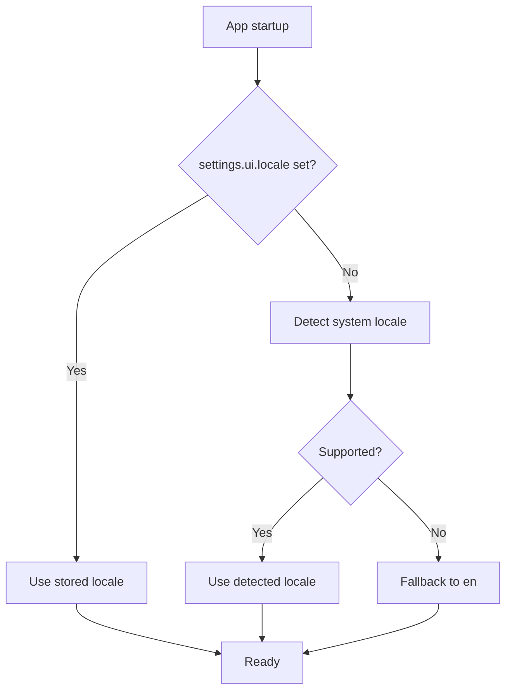

# RFC 017 — Internationalization and Language Resources

## 1. Summary

This RFC defines the internationalization (i18n) model for the migrated Dioxus app. The project requirements state that the GUI must support multiple languages. This RFC makes i18n a structural property of the UI layer from the first screen instead of a retrofit: every user-visible string is resolved through a locale-aware catalog.

## 2. Motivation

The original RFC set (001–016) specifies user-facing copy in English but does not define how that copy is localized. Retrofitting i18n after UI parity is expensive and error-prone: hard-coded strings spread through components, error messages, toasts, tooltips, and accessibility labels. Defining the catalog boundary now keeps the cost near zero while the UI is still small.

## 3. Goals

- Define a locale model and a message catalog abstraction.
- Require all user-visible strings (labels, toasts, errors, tooltips, accessible names) to resolve through the catalog.
- Define locale selection: explicit user setting, with system-locale detection as the default.
- Define fallback rules when a key or locale is missing.
- Ship English (`en`) as the reference locale and Japanese (`ja`) as the first translation target.

## 4. Non-Goals

- Right-to-left layout support in the first release.
- Pluralization/gender grammar engines beyond simple parameterized messages.
- Localizing PDF document content (the document is user data, not UI).
- Translating log/diagnostic output (logs remain English).

## 5. Locale Model

```rust
#[derive(Clone, Copy, Debug, Eq, PartialEq, Default)]
pub enum Locale {
    #[default]
    En,
    Ja,
}
```

Adding a locale is a code-plus-catalog change, not an architectural change. The enum may later be replaced by a BCP 47 string type if the locale set grows; the catalog API must not leak the storage representation.

## 6. Catalog Model

```rust
pub trait MessageCatalog {
    fn text(&self, locale: Locale, key: MessageKey) -> &str;
}

#[derive(Clone, Copy, Debug, Eq, PartialEq, Hash)]
pub enum MessageKey {
    AppTagline,
    DashboardDropHint,
    DashboardChooseFile,
    // ... one variant per user-visible string
}
```

Rules:

1. `MessageKey` is a closed enum so that missing translations are compile-visible, not runtime surprises.
2. Parameterized messages take typed arguments (e.g., page numbers) and are formatted by small functions per key family, not by ad hoc string concatenation in components.
3. Domain errors map to `MessageKey` values at the app-service boundary; `domain` and `pdf_engine` never contain localized text.

## 7. Locale Selection Lifecycle



The locale becomes part of the settings schema (RFC 008):

```rust
pub struct UiSettings {
    pub locale: Option<LocaleTag>, // None = follow system
}
```

## 8. Fallback Rules

1. If a key is missing in the active locale catalog, fall back to `en`.
2. If a key is missing in `en`, that is a defect; tests must fail.
3. Untranslated keys are acceptable during development but must be tracked before release.

## 9. Testing Requirements

- A unit test asserts every `MessageKey` resolves to a non-empty string for the reference locale `en`.
- A unit test asserts the `ja` catalog has no keys resolving to empty strings (untranslated keys may intentionally fall back, but never to empty output).
- Layout-affecting strings (long German/Japanese variants) should be considered when reviewing component sizing, but pixel assertions are out of scope.

## 10. Relationship to Other RFCs

- RFC 001: the app shell must render its first strings through the catalog.
- RFC 008: the settings schema gains `ui.locale`.
- RFC 013: accessible names and labels are also catalog-resolved.
- Future RFC-F06: the same catalog serves the offline web target unchanged.

## 11. Acceptance Criteria

- No user-visible string literal appears directly in a Dioxus component; all go through the catalog.
- Switching the locale setting changes UI strings after restart (live switching is optional, restart-based switching is acceptable for the first release).
- `en` and `ja` catalogs exist and pass the completeness tests.
- Domain and PDF engine crates contain no localized strings.

## 12. Risks

| Risk | Mitigation |
|---|---|
| Key enum grows unwieldy | Group keys by screen/feature in submodules; review at each RFC milestone. |
| Translations lag behind features | `en` fallback keeps the app usable; track untranslated keys before release. |
| String concatenation sneaks past the catalog | Code review rule plus a grep-based CI lint for string literals in `rsx!` blocks. |
